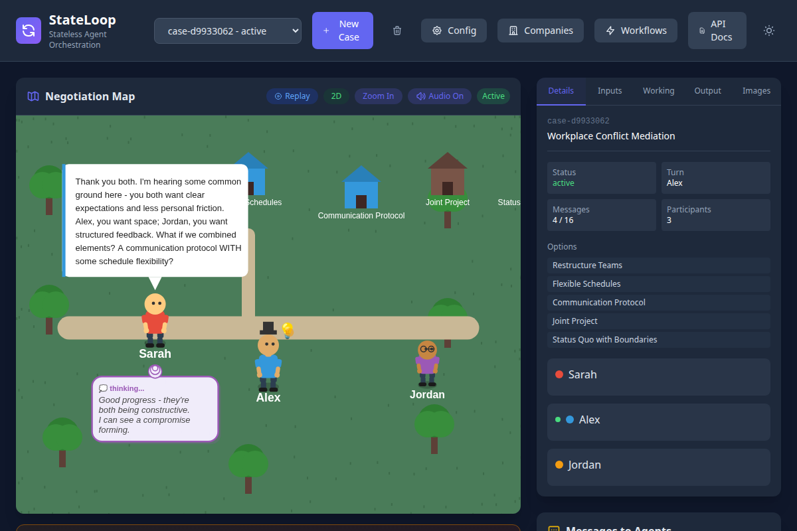
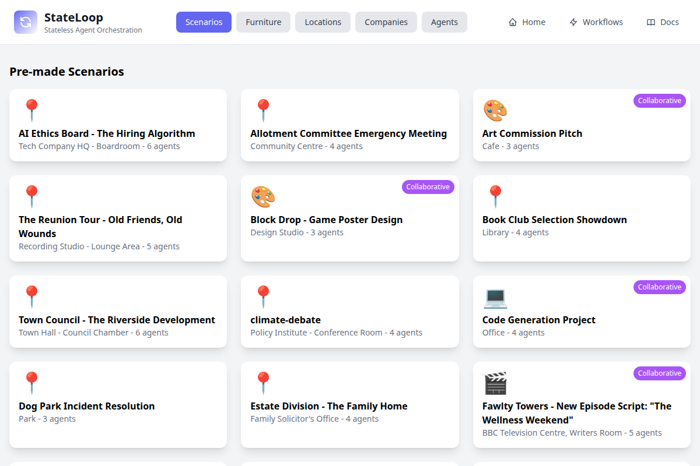
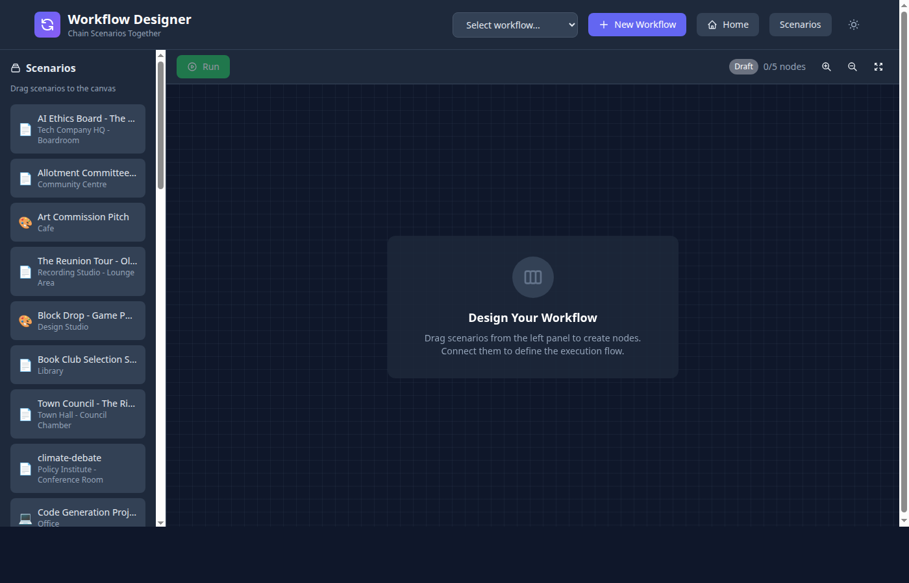
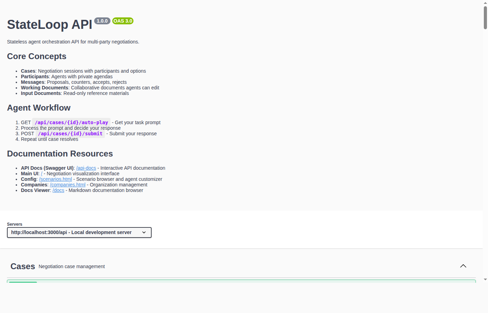
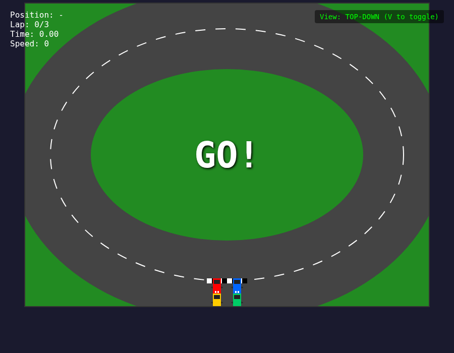
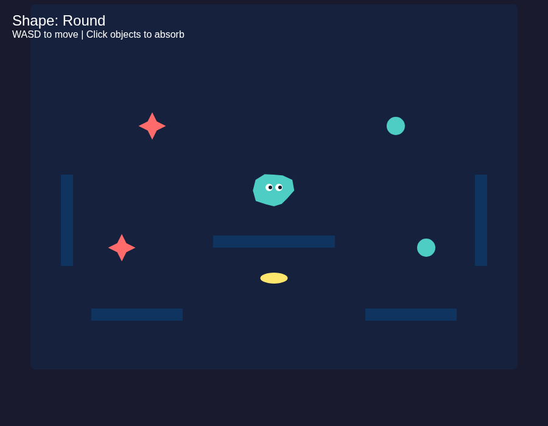
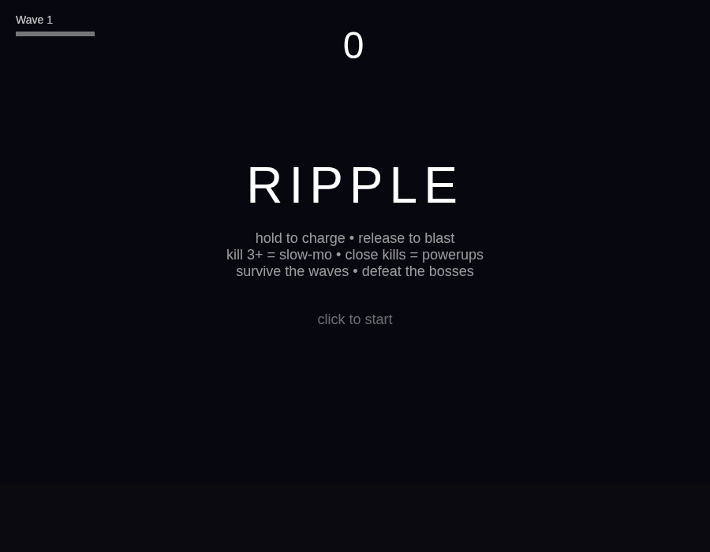

# StateLoop

A multi-agent negotiation system where AI agents discuss options and reach consensus through turn-based conversations. Agents have private agendas, configurable personalities, and hidden constraints — creating realistic negotiations, collaborative writing sessions, and decision-making simulations.

Built with TypeScript, Express, SQLite, and the Anthropic Claude SDK.



Three Thronglet agents in a workplace mediation — Sarah (mediator) speaks while her private thoughts appear below. Alex and Jordan wait with their own hidden agendas. The right panel tracks case status, options, and participants.

## Quick Start

```bash
npm install
npm run dev
```

Open http://localhost:3000

| URL | What you'll find |
|-----|-----------------|
| `/` | Main negotiation UI with Thronglet map |
| `/scenarios.html` | Browse scenarios, furniture, locations, companies, agents |
| `/workflows.html` | Workflow designer for multi-stage pipelines |
| `/api-docs` | Interactive Swagger API documentation |

## Features

- **Multi-agent negotiations** — Agents take turns proposing, countering, accepting, or rejecting options
- **Private agendas** — Each agent has hidden goals and constraints others can't see
- **Configurable personalities** — Agreeability scores (0-100), traits like patience, empathy, assertiveness
- **Collaborative document editing** — Agents co-write scripts, proposals, and notes in real-time
- **Automatic resolution detection** — Cases resolve on consensus, fail on timeout or repeated rejections
- **35+ built-in scenarios** — From workplace mediation to comedy script writing to jury deliberation
- **Visual UI** — 2D/isometric map with animated Thronglet agents, text-to-speech, conversation replay
- **Workflow designer** — Chain scenarios into multi-stage pipelines
- **Company management** — Persistent organizations with buildings, rooms, policies, and employees
- **Forms & mediation agreements** — Generate formal documentation on case resolution
- **Full REST API** — Every feature accessible via API with Swagger documentation
- **Built-in simulation** — Run negotiations to completion automatically with Claude AI

## Scenario Browser

Browse 35+ pre-made scenarios covering workplace disputes, creative collaborations, civic debates, and more.



- **Workplace** — mediation, feature planning, code review, union negotiation
- **Creative** — Fawlty Towers script writing, art commission, game design pitch, podcast planning
- **Civic** — city council zoning, climate debate, jury deliberation, school policy
- **Personal** — wedding planning, flatmate interview, family inheritance
- **Healthcare** — hospital hydration policy, AI ethics board

## Locations & Furniture

Six environments — Hospital, Library, Office, School, Cafe, Park — each with matching furniture that automatically populates the negotiation map.


Furniture renders in both 2D and isometric 3D:


## Agent Customizer

Design Thronglet appearances with control over body type, skin tone, hair, clothing, accessories, professional roles, and mobility aids. Live preview updates instantly.


## Workflow Designer

Chain scenarios into multi-stage pipelines. Output from one stage feeds into the next.



## How It Works

```
1. Write a scenario (or pick a built-in one)
2. POST /api/cases to create a negotiation case
3. AI reads the scenario and sets up agents, options, and documents
4. Agents take turns — each gets the full conversation context + their private agenda
5. Each turn produces a response: proposal, counter, accept, reject, or message
6. System checks resolution rules after each turn
7. Case resolves when agents reach consensus (or fails on timeout/rejection)
```

Each agent is **stateless** — they receive the entire conversation context on every turn, making the system reliable and debuggable.

## Writing Scenarios

Scenarios are plain text files:

```
SCENARIO: Team Dinner Choice
LOCATION: Office Break Room
ICON: 🍽️

AGENT: Alice
AGENDA: You're paying, so budget matters. Prefer somewhere quiet.
AGREEABILITY: 60

AGENT: Bob
AGENDA: You love bold flavors and lively atmosphere. Won't go somewhere boring.
AGREEABILITY: 55

OPTIONS:
- Italian Place: Pasta, quiet atmosphere, $$
- Mexican Grill: Tacos, lively, $
- Sushi Bar: Fresh fish, trendy, $$$

RULES:
- Both must accept for resolution

MAX_ROUNDS: 10
```

### Task Types

| Type | Use For | Example |
|------|---------|---------|
| `options` (default) | Choosing between options | Restaurant choice, hiring decision |
| `document` | Collaborative writing | Script writing, proposal drafting |
| `both` | Options + document output | Design pitch with mockup |

## API Overview

```bash
# Create a case
curl -X POST http://localhost:3000/api/cases -d '{"scenario": "..."}'

# Get the AI prompt for the current agent
curl http://localhost:3000/api/cases/{id}/auto-play

# Submit agent setup and first message
curl -X POST http://localhost:3000/api/cases/{id}/setup -d '{"setup": {...}}'

# Submit agent responses (loop until resolved)
curl -X POST http://localhost:3000/api/cases/{id}/submit -d '{"response": {...}}'

# Or run the entire negotiation automatically
curl -X POST http://localhost:3000/api/cases/{id}/run
```

| Method | Endpoint | Description |
|--------|----------|-------------|
| `POST` | `/api/cases` | Create negotiation case |
| `GET` | `/api/cases/:id/auto-play` | Get prompt for current agent |
| `POST` | `/api/cases/:id/setup` | AI submits setup + first message |
| `POST` | `/api/cases/:id/submit` | Submit agent response |
| `POST` | `/api/cases/:id/run` | Run to completion |
| `GET` | `/api/scenarios` | List available scenarios |
| `POST` | `/api/cases/:id/documents` | Create working document |
| `GET/POST` | `/api/companies` | Manage organizations |



## Agent-Built Projects

The workflow system — where agents brainstorm, plan, and code together — produced these playable projects:

### Stack Games (`/stack-games.html`)
Five physics-based stacking games: Balloon Stack, Shape Tower, Balloon Stacker, Hot Air Balloons, and Airplane Hangar.


### More Creations

| | |
|---|---|
|  |  |
| **Top-Down Racer** — Oval track racing with AI opponents and switchable camera views | **Blobform** — A shape-shifting blob that absorbs objects and morphs between round, spiky, and flat |



**RIPPLE** — Wave-survival game. Hold to charge, release to blast. Kill 3+ for slow-mo, close kills drop powerups.

All single HTML files with no dependencies, built entirely through agent collaboration.

## Architecture

```
stateLoop/
├── scenarios/          # 35+ example scenario files
├── public/             # Web UI (vanilla JS, Canvas2D)
│   ├── index.html      # Main negotiation interface
│   ├── scenarios.html  # Scenario browser
│   ├── companies.html  # Organization management
│   ├── workflows.html  # Workflow designer
│   └── js/             # Canvas rendering engine
├── src/
│   ├── index.ts        # Express server entry point
│   ├── api/
│   │   └── routes.ts   # All REST API endpoints
│   ├── services/       # Business logic
│   │   ├── caseService.ts     # Case lifecycle
│   │   ├── taskService.ts     # Agent task/response handling
│   │   ├── agentService.ts    # Agent management
│   │   └── companyService.ts  # Organization management
│   ├── storage/
│   │   └── sqlite.ts   # SQLite database layer
│   └── types/
│       └── index.ts    # TypeScript type definitions
├── tests/              # Test suite (vitest)
├── docs/               # Additional documentation
└── screenshots/        # UI screenshots
```

## Tech Stack

- **Runtime**: Node.js + TypeScript
- **Server**: Express.js
- **Database**: SQLite (better-sqlite3)
- **AI**: Anthropic Claude SDK
- **Frontend**: Vanilla JS, HTML5 Canvas
- **API Docs**: Swagger UI (OpenAPI 3.0)
- **Testing**: Vitest

## Development

```bash
npm run dev           # Dev server with hot reload
npm test              # Run tests
npm run typecheck     # Type checking
npm run lint          # Linting
npm run swagger:generate  # Regenerate API docs
```

## Documentation

| Document | Purpose |
|----------|---------|
| [Getting Started](docs/getting-started.md) | Illustrated guide for new users |
| [SCENARIO_FORMAT.md](SCENARIO_FORMAT.md) | Full scenario authoring specification |
| [SPECIFICATION.md](SPECIFICATION.md) | System architecture & API details |
| [DEVELOPMENT.md](DEVELOPMENT.md) | Development guide |
| [FEATURE_SPECS.md](FEATURE_SPECS.md) | UI features documentation |

## License

MIT
