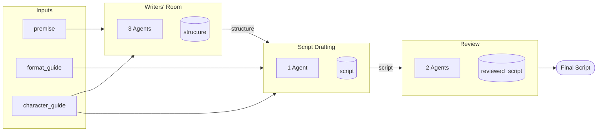

# StateLoop Specification

StateLoop is a stateless agent orchestration system for multi-agent negotiations. This document describes the complete specification, requirements, and behavior of the system.

## Table of Contents

1. [Quick Start](#quick-start)
2. [Overview](#overview)
3. [Core Concepts](#core-concepts)
4. [Scenario Format](#scenario-format)
5. [Agent Behavior](#agent-behavior)
6. [Resolution Logic](#resolution-logic)
7. [API Reference](#api-reference)
   - [Core Endpoints](#core-endpoints)
   - [Agent Endpoints](#agent-endpoints-llm-integration)
   - [AI Setup Endpoints](#ai-setup-endpoints)
   - [Document Endpoints](#document-endpoints)
   - [Agent Profile Endpoints](#agent-profile-endpoints)
   - [Management Endpoints](#management-endpoints)
8. [Data Types](#data-types)
9. [Validation](#validation)
10. [Error Handling](#error-handling)
11. [Audio / Text-to-Speech](#audio--text-to-speech)
12. [Agent Visualization](#agent-visualization)
13. [Company API](#company-api)
14. [Sample Scenarios](#sample-scenarios)
15. [Process Flows (Workflows)](#process-flows-workflows)
16. [Goal-Driven Workflows](#goal-driven-workflows-dynamic-flows)
17. [Workflow Visualization & UI](#workflow-visualization--ui)
18. [Document Flow Between Tasks](#document-flow-between-tasks)
19. [Job Matching & Agent Vetting (Planned)](#job-matching--agent-vetting-planned)
20. [Workflow Designer](#workflow-designer)

---

## Quick Start

```bash
# Start the development server
./dev-all.sh

# Or for production
./prod-all.sh
```

**Available URLs:**

| URL | Description |
|-----|-------------|
| http://localhost:3000 | Main UI - negotiation visualization |
| http://localhost:3000/api-docs | Interactive API documentation (Swagger UI) |
| http://localhost:3000/scenarios.html | Scenario browser and agent customizer |
| http://localhost:3000/companies.html | Organization management |
| http://localhost:3000/docs | Documentation viewer |

---

## Overview

StateLoop orchestrates multi-agent negotiations where AI agents (or human participants) take turns discussing, proposing, and accepting/rejecting options until a resolution is reached or the negotiation fails.

### Key Features

- **Stateless Design**: Each agent receives all context needed to make a decision in a single API call
- **Turn-Based**: Agents take turns in sequence
- **Private Agendas**: Each agent has private information only they know
- **Agreeability**: Configurable personality trait (0-100) affecting compromise willingness
- **Timeout Handling**: Negotiations fail after MAX_ROUNDS
- **Reject Handling**: 3 rejections cause negotiation failure
- **Generic Options**: Supports any decision-making scenario (policies, projects, movies, etc.)

---

## Core Concepts

### Case

A negotiation instance containing:
- Scenario description (public + private agent info)
- List of participants
- Available options to choose from
- Message history
- Current turn indicator
- Status (active/resolved) and outcome

### Participant/Agent

An entity in the negotiation with:
- **Name**: Display name
- **Preferences**: What they prefer (array)
- **Constraints**: Hard limits they won't violate (array)
- **Agreeability**: 0-100 scale (0 = stubborn, 100 = very agreeable)
- **isPayer**: Whether they're paying (optional, for budget scenarios)

### Option

A choice available in the negotiation:
- **Name**: Display name
- **Category**: Type/classification (e.g., "Comedy", "Italian", "Policy A")
- **Price Range**: Cost indicator ($, $$, $$$)
- **Features**: Array of characteristics

### Message

A turn in the conversation:
- **Author**: Participant ID
- **Type**: `proposal`, `counter`, `accept`, `reject`, `message`
- **Content**: The text content
- **Thoughts**: Internal reasoning (shown to observers, not other agents)
- **optionId**: Which option is being proposed (if applicable)
- **agentContext**: Private agenda (stored for reference)

---

## Scenario Format

Scenarios are plain text documents that define the negotiation setup. The AI reads and interprets the scenario, then creates all necessary entities (agents, options, documents) via API calls.

### AI-Driven Setup (Recommended)

Write scenarios in natural language. The AI will:
1. Read the scenario text
2. Identify agents, options, documents, and rules
3. Create entities via `POST /api/cases/:id/setup`
4. Start the conversation

No strict format required - the AI interprets the content flexibly.

### Optional Structured Tags

For explicit control, you can use these tags:

```
LOCATION: [Where the scenario takes place]
ICON: [Emoji icon, e.g., 🏥, 🎬, ⚖️]
SCENARIO: [Title of the negotiation]
TASK_TYPE: [options | document | both]
MAX_ROUNDS: [number, e.g., 15]

AGENT: [Name]
AGENDA: [Private instructions only this agent sees]
AGREEABILITY: [0-100]

RULES:
- [Resolution conditions]
- [Failure conditions]

OPTIONS:
- [Option 1]: [Description]
- [Option 2]: [Description]
```

### Example Scenario

```
PUBLIC INFO:
Scenario: Roommates deciding what movie to watch for movie night.
Participants: Moderator, Chris, Pat, Morgan

MAX_ROUNDS: 12

AGENT: Moderator
AGENDA: You welcome everyone to movie night. Say "Alright everyone, time to pick tonight's movie! Chris, what are you in the mood for?" Use type "message" only. Keep things light and fun.

AGENT: Chris
AGENDA: You had a stressful week and want something light - a comedy or feel-good movie. You hate horror films (they give you nightmares). You're pretty easy-going though. AGREEABILITY: 75. Hard stance: absolutely no horror.

AGENT: Pat
AGENDA: You're a film buff who prefers critically acclaimed movies. You'd love an indie drama or foreign film, but you'll compromise for something with good reviews. You secretly enjoy action movies but won't admit it. AGREEABILITY: 55. Hard stance: nothing with less than 70% on Rotten Tomatoes.

AGENT: Morgan
AGENDA: You want something everyone will enjoy - you're the peacemaker. You lean toward action or adventure films since they're crowd-pleasers. You're very agreeable but get frustrated when people are stubborn. AGREEABILITY: 85. No hard stances - you just want the group to be happy.

RULES:
- Case resolves when Chris and Pat both accept (Morgan always tries to help)
- The group needs consensus to enjoy movie night
- If too many rejections, everyone just watches their own thing (failure)

OPTIONS:
- The Grand Budapest Hotel: Comedy/Drama, 92% RT, Wes Anderson visual style
- Everything Everywhere All at Once: Action/Comedy/Drama, 95% RT, wild and emotional
- Top Gun Maverick: Action, 96% RT, crowd-pleaser, exciting
- Hereditary: Horror/Drama, 89% RT, critically acclaimed but terrifying
```

---

## Agent Behavior

### Agreeability Scale

The agreeability value (0-100) influences how an agent behaves:

| Range | Behavior |
|-------|----------|
| 0-20 | Very stubborn, rarely compromises, may reject repeatedly |
| 21-40 | Resistant, needs strong arguments to change position |
| 41-60 | Moderate, willing to find middle ground |
| 61-80 | Agreeable, actively seeks compromise |
| 81-100 | Very agreeable, quick to accept reasonable proposals |

### Variability & Randomness

To create natural, unpredictable conversations, the system supports variability at multiple levels.

#### Agent-Level Variability

Each agent can have personality traits that affect response unpredictability:

```typescript
interface AgentVariability {
  variability: number;        // 0.0 = predictable, 1.0 = chaotic (default: 0.5)
  mood: AgentMood;            // Current emotional state
  quirks: string[];           // Behavioral tendencies
  triggers: string[];         // Topics that provoke strong reactions
}

type AgentMood =
  | 'neutral'      // Default state
  | 'enthusiastic' // More likely to agree, build on ideas
  | 'skeptical'    // Questions everything, plays devil's advocate
  | 'tired'        // Short responses, quicker to compromise
  | 'frustrated'   // May reject, get confrontational
  | 'distracted'   // Goes on tangents, misses points
  | 'inspired';    // Creative, proposes unexpected solutions
```

**Scenario format:**
```
AGENT: Sarah
AGENDA: You're the head writer...
AGREEABILITY: 55
VARIABILITY: 0.7
MOOD: enthusiastic
QUIRKS: gets sidetracked by film references, changes mind when complimented
TRIGGERS: anyone suggesting something "off-brand"
```

#### Case-Level Temperature

The case/scenario can specify overall randomness:

```typescript
interface CaseVariability {
  temperature: number;        // 0.0 = deterministic, 1.0 = creative (default: 0.5)
  moodSwings: boolean;        // Agents' moods shift during conversation
  randomEvents: boolean;      // Inject interruptions, distractions
  chaosLevel: ChaosLevel;     // Overall unpredictability
}

type ChaosLevel = 'calm' | 'normal' | 'heated' | 'chaotic';
```

**Scenario format:**
```
TEMPERATURE: 0.7
MOOD_SWINGS: true
RANDOM_EVENTS: true
CHAOS_LEVEL: normal
```

#### Variability Effects

| Variability | Behavior |
|-------------|----------|
| 0.0 - 0.2 | Highly predictable, follows agenda strictly |
| 0.3 - 0.4 | Mostly predictable, occasional surprises |
| 0.5 | Balanced - follows agenda but open to pivots |
| 0.6 - 0.7 | Unpredictable - frequently changes position |
| 0.8 - 1.0 | Chaotic - may contradict themselves, wild tangents |

#### Mood Effects

| Mood | Effect on Behavior |
|------|-------------------|
| `neutral` | No modifier, follows agreeability |
| `enthusiastic` | +20 effective agreeability, builds on others' ideas |
| `skeptical` | -20 effective agreeability, questions proposals |
| `tired` | Shorter responses, +30 agreeability (wants to finish) |
| `frustrated` | -30 agreeability, confrontational tone |
| `distracted` | May miss points, go on tangents, random topic shifts |
| `inspired` | Proposes creative combinations, unexpected solutions |

#### Dynamic Mood Shifts

When `moodSwings: true`, agent moods evolve based on conversation:

| Event | Mood Shift |
|-------|------------|
| Idea accepted | → `enthusiastic` |
| Idea rejected | → `frustrated` (if low agreeability) or `tired` (if high) |
| Complimented | → `enthusiastic`, +10 agreeability for next response |
| Criticized | → `skeptical` or `frustrated` |
| Long debate (>5 turns) | → `tired` |
| Creative solution proposed | → `inspired` |

#### Random Events

When `randomEvents: true`, the system may inject:

| Event | Effect |
|-------|--------|
| Phone interruption | Agent distracted, shorter response |
| Coffee break suggested | Mood reset to neutral |
| External deadline | All agents +20 agreeability |
| Someone's point misheard | Comedic misunderstanding |
| Side conversation | Two agents briefly align against third |

#### Prompt Template Integration

When generating prompts for LLM-driven responses, include variability context:

```
YOUR PERSONALITY:
- Agreeability: 55 (moderate)
- Variability: 0.7 (fairly unpredictable)
- Current mood: enthusiastic
- Quirks: gets sidetracked by film references
- Triggers: anyone suggesting something "off-brand"

VARIABILITY GUIDANCE:
With variability 0.7, you should:
- Sometimes agree with ideas you wouldn't normally support
- Occasionally go on brief tangents
- React emotionally to trigger topics
- Propose unexpected combinations
- Don't always push your stated preference
```

#### Example: High vs Low Variability

**Low variability (0.2) Sarah:**
> "Cold Open A is the way to go. Basil's physical comedy is essential. I won't compromise on this."

**High variability (0.8) Sarah:**
> "Actually, you know what? Marcus has a point about Manuel. Remember that bit in 'Communication Problems' where he gets the hearing aid confused? What if we opened with... wait, no, I had another thought. What about combining ALL four options somehow?"

### Private Agendas

Each agent has a private agenda that:
- Is only visible to that agent
- Contains their preferences, constraints, and personality
- May include "hard stances" they won't violate
- Can include suggested opening lines (e.g., `Say "Hello everyone!"`)

### Moderator Role

Moderators (or Adjudicators) have special behavior:
- Do NOT accept or reject proposals
- Only use type `message` to facilitate discussion
- Are excluded from consensus requirements
- Help keep the conversation moving

---

## Resolution Logic

### Success Conditions

A case resolves successfully when:

1. **Option Selection**: Multiple participants accept the same optionId
   - For 3 or fewer negotiators: all must accept
   - For 4+ negotiators: majority (50%+1) must accept
2. **Proposal Acceptance**: A participant accepts another participant's proposal
3. **Debate Scenarios**: All negotiating participants have accepted (no specific optionId)

**Resolution Order**: Success conditions are checked BEFORE timeout, ensuring that if consensus is reached on the final round, the case resolves as `agreed` rather than timing out.

### Failure Conditions

A case fails when:

1. **Too Many Rejections**: 3 or more `reject` messages are recorded
2. **Timeout**: Message count reaches MAX_ROUNDS without resolution
3. **Manual Resolution**: An admin resolves the case as `failed`

### Outcome Values

- `agreed`: Participants reached consensus
- `failed`: Negotiation failed (timeout, rejections, or manual)
- `deadlocked`: No progress possible (rarely used)

### Reopening Cases

Resolved cases can be reopened by sending a boss message. This allows the facilitator to continue discussions if needed.

---

## API Reference

### Core Endpoints

| Method | Endpoint | Description |
|--------|----------|-------------|
| GET | `/api/` | API welcome and discovery |
| GET | `/api/cases` | List all cases |
| POST | `/api/cases` | Create a new case |
| GET | `/api/cases/:id` | Get case details |
| GET | `/api/cases/:id/history` | Get conversation history for playback |
| POST | `/api/cases/:id/submit` | Submit agent response (returns next prompt) |
| POST | `/api/cases/:id/resolve` | Manually resolve case |

### Agent Endpoints (LLM Integration)

| Method | Endpoint | Description |
|--------|----------|-------------|
| GET/POST | `/api/cases/:id/auto-play` | Get prompt for current agent's turn |
| POST | `/api/cases/:id/submit` | Submit response, receive next prompt |
| POST | `/api/cases/:id/run` | Run case to completion (built-in simulation, auto-writes to documents) |
| GET | `/api/cases/:id/agent-prompt` | Get prompt for specific agent (requires agentId) |
| GET | `/api/cases/:id/next-task` | Get JSON task for specific agent |

### LLM Integration Flow

The system is designed for external LLM (e.g., Claude) to drive the conversation.

#### AI-Driven Setup (Recommended)

The AI reads the scenario and sets up entities (agents, options, documents):

1. **Create Case**: `POST /api/cases` with scenario text
2. **Get Setup Prompt**: `GET /api/cases/:id/auto-play`
   - Returns a SETUP PROMPT asking AI to analyze the scenario
   - AI extracts agents, options, documents, and rules
3. **Submit Setup**: `POST /api/cases/:id/setup` with structured JSON
   - AI provides all entities to create + first agent's opening message
   - Returns next agent's prompt
4. **Continue**: Process prompts and submit until resolved

This approach is flexible - scenarios can use natural language instead of strict formatting.

#### Alternative: Direct Entity Creation

The AI can also create entities individually:

- `POST /api/cases/:id/agents` - Create an agent
- `POST /api/cases/:id/options` - Create an option
- `POST /api/cases/:id/input-documents` - Create input document
- `POST /api/cases/:id/documents` - Create working document

#### Legacy: Format-Based Setup

If the scenario contains explicit `AGENT:` and `OPTIONS:` tags, the system can use regex extraction. This is still supported but AI-driven setup is preferred.

```bash
# Initial call - get first agent's prompt
curl "http://localhost:3000/api/cases/case-123/auto-play"

# Submit response - receive next agent's prompt in response
curl -X POST "http://localhost:3000/api/cases/case-123/submit" \
  -H "Content-Type: application/json" \
  -d '{
    "taskId": "task-abc",
    "agentId": "case-123-person-0",
    "response": {
      "type": "message",
      "thoughts": "I should introduce the topic...",
      "content": "Welcome everyone, let'\''s discuss our options."
    }
  }'
```

### AI Setup Endpoints

| Method | Endpoint | Description |
|--------|----------|-------------|
| POST | `/api/cases/:id/setup` | AI submits full setup analysis (bulk create all entities) |
| POST | `/api/cases/:id/agents` | Create a single agent in the case |
| POST | `/api/cases/:id/options` | Create a single option/choice in the case |
| GET | `/api/furniture` | Get furniture catalog for location setup |

#### Setup Endpoint

`POST /api/cases/:id/setup`

The AI analyzes the scenario and submits structured setup data:

```json
{
  "setup": {
    "title": "Movie Night Decision",
    "location": {
      "type": "cafe",
      "name": "Living Room",
      "furniture": ["cafe_table", "armchair", "armchair", "bookshelf"]
    },
    "icon": "🎬",
    "taskType": "options",
    "maxRounds": 15,
    "agents": [
      {
        "name": "Chris",
        "role": "Roommate",
        "agenda": "Wants a comedy, hates horror",
        "agreeability": 75,
        "appearance": {
          "accessory": "glasses",
          "bodyStyle": "normal",
          "color": "#3498db",
          "gender": "male"
        },
        "profile": {
          "dateOfBirth": "1992-03-15",
          "nationality": "American",
          "sex": "male",
          "heightCm": 178,
          "build": "average",
          "eyeColor": "blue",
          "hairColor": "brown",
          "backstory": "Film enthusiast who runs a small movie review blog",
          "personalityTraits": ["opinionated", "enthusiastic", "loyal"]
        }
      }
    ],
    "options": [
      { "name": "The Grand Budapest Hotel", "description": "Comedy/Drama, 92% RT" }
    ],
    "inputDocuments": [
      { "name": "movie_reviews", "content": "..." }
    ],
    "workingDocuments": [
      { "name": "watch_list", "description": "Shared list of movies to consider" }
    ],
    "publicInfo": "Roommates choosing a movie for movie night",
    "rules": "All roommates must agree on the selection"
  },
  "firstAgent": {
    "name": "Moderator",
    "thoughts": "Time to kick off movie night!",
    "message": "Alright everyone, let's pick tonight's movie!"
  }
}
```

##### Location Object

The `location` field controls the visual environment:

| Field | Type | Description |
|-------|------|-------------|
| `type` | string | Location type: `hospital`, `office`, `school`, `library`, `cafe`, `park`, `studio`, `courtroom`, `outdoor` |
| `name` | string | Display name (e.g., "South Bristol Hospital - Rehab Ward") |
| `furniture` | string[] | Optional list of furniture item IDs to place. If omitted, defaults for the location type are used. |

##### Profile Object (Required for Character Illustration)

The `profile` field creates detailed character data for image generation, visualization, and rich backstories:

**Identity Fields:**

| Field | Type | Description |
|-------|------|-------------|
| `dateOfBirth` | string | Date of birth (YYYY-MM-DD format) |
| `placeOfBirthCity` | string | City of birth |
| `placeOfBirthCountry` | string | Country of birth |
| `nationality` | string | Primary nationality |
| `nationalities` | string[] | Multiple nationalities |
| `sex` | string | `male`, `female`, or `other` |

**Body (for drawing):**

| Field | Type | Description |
|-------|------|-------------|
| `heightCm` | number | Height in centimeters |
| `weightKg` | number | Weight in kilograms |
| `build` | string | `slim`, `average`, `athletic`, `stocky`, `heavy` |
| `skinTone` | string | `very_fair`, `fair`, `light`, `medium`, `olive`, `tan`, `brown`, `dark_brown`, `deep` |
| `ageAppearance` | number | Apparent age (may differ from DOB-calculated age) |
| `posture` | string | `upright`, `slouched`, `rigid`, `relaxed`, `hunched`, `confident`, `defensive` |
| `gait` | string | `confident_stride`, `shuffle`, `brisk`, `slow`, `limping`, `bouncy`, `graceful`, `heavy` |

**Face (for drawing):**

| Field | Type | Description |
|-------|------|-------------|
| `faceShape` | string | `round`, `oval`, `square`, `heart`, `long`, `diamond`, `rectangular`, `triangular` |
| `eyeColor` | string | `brown`, `blue`, `green`, `hazel`, `gray`, `amber` |
| `eyeShape` | string | `almond`, `round`, `hooded`, `downturned`, `upturned`, `monolid`, `deep_set`, `wide_set`, `close_set` |
| `noseShape` | string | `straight`, `roman`, `button`, `upturned`, `hooked`, `wide`, `narrow`, `bulbous` |
| `lipShape` | string | `thin`, `full`, `bow_shaped`, `wide`, `downturned`, `asymmetric` |
| `eyebrowShape` | string | `straight`, `arched`, `rounded`, `flat`, `S_shaped`, `thick`, `thin`, `bushy` |
| `chinShape` | string | `pointed`, `rounded`, `square`, `cleft`, `double`, `receding`, `prominent` |
| `complexion` | string | `clear`, `freckled`, `weathered`, `rosy`, `pale`, `ruddy`, `acne_scarred`, `wrinkled`, `smooth` |
| `restingExpression` | string | `neutral`, `friendly`, `stern`, `tired`, `worried`, `amused`, `intense`, `dreamy` |

**Hair:**

| Field | Type | Description |
|-------|------|-------------|
| `hairColor` | string | `black`, `brown`, `blonde`, `red`, `gray`, `white`, `auburn`, `strawberry_blonde`, `silver`, `platinum` |
| `hairStyle` | string | `short`, `medium`, `long`, `bald`, `buzzed`, `curly`, `wavy`, `straight`, `ponytail`, `bun`, `braided`, `dreadlocks`, `afro`, `mohawk`, `undercut` |
| `hairLength` | string | `bald`, `very_short`, `short`, `medium`, `long`, `very_long` |
| `facialHair` | string | `none`, `stubble`, `goatee`, `mustache`, `beard`, `full_beard`, `sideburns`, `mutton_chops` |
| `hairTexture` | string | Free text (e.g., 'fine', 'coarse', 'wiry') |
| `grayPercentage` | number | 0-100, for aging effects |

**Accessories & Distinguishing Marks:**

| Field | Type | Description |
|-------|------|-------------|
| `glasses` | string | `none`, `reading`, `prescription`, `sunglasses`, `round`, `square`, `rimless`, `cat_eye`, `aviator`, `thick_frame` |
| `jewelry` | string[] | `earrings`, `necklace`, `rings`, `watch`, `bracelet`, `piercing`, `nose_ring`, `eyebrow_ring` |
| `tattoos` | object[] | Array of `{description, location, visible}` |
| `scars` | object[] | Array of `{description, location, visible}` |
| `birthmarks` | object[] | Array of `{description, location, visible}` |
| `distinguishingFeatures` | string[] | Other notable features |

**Clothing:**

| Field | Type | Description |
|-------|------|-------------|
| `clothingStyle` | string | `casual`, `business`, `formal`, `uniform`, `creative`, `sporty`, `bohemian`, `punk`, `vintage`, `minimalist` |
| `primaryClothingColor` | string | Hex color |
| `secondaryClothingColor` | string | Hex color |
| `typicalOutfit` | string | Description of what they usually wear |

**Voice & Mannerisms:**

| Field | Type | Description |
|-------|------|-------------|
| `voiceDescription` | string | e.g., 'Deep and gravelly with a slight rasp' |
| `accentDescription` | string | e.g., 'Mild Yorkshire accent' |
| `mannerisms` | string[] | e.g., ['Taps fingers when thinking', 'Clears throat before speaking'] |

**Personality:**

| Field | Type | Description |
|-------|------|-------------|
| `backstory` | string | Brief overall background |
| `personalityTraits` | string[] | Array of personality traits |

**Life History (Growing Up):**

| Field | Type | Description |
|-------|------|-------------|
| `childhoodSummary` | string | Brief description of their childhood |
| `childhoodLocation` | string | Where they grew up |
| `familyBackground` | string | Parents, siblings, family dynamics |
| `education` | string[] | Schools, degrees, certifications |
| `careerPath` | string[] | Job history in chronological order |
| `significantEvents` | string[] | Life-changing moments, turning points |
| `formativeExperiences` | string[] | Experiences that shaped who they are |
| `relationships` | string[] | Key people in their life |
| `currentSituation` | string | Where they are in life now |
| `fears` | string[] | What they're afraid of |
| `desires` | string[] | What they want in life |
| `secrets` | string[] | Things they don't share openly |
| `skills` | string[] | Abilities and talents |
| `hobbies` | string[] | What they do for fun |

All profile fields are optional. Profiles are stored persistently and can be retrieved via `GET /api/agents/:name/profile`.

**Case History Tracking:**

When agents join a case during setup, their participation is automatically recorded. Each agent maintains a history of all cases they've participated in, including:
- Case ID and scenario title
- Their role in the case
- Outcome (agreed/failed/pending)
- Timestamp

**Automatic Outcome Updates:** When a case resolves (via consensus, timeout, or manual resolution), the system automatically updates all participating agents' history records with the final outcome. This ensures agent history always reflects accurate case results.

Retrieve an agent's case history via `GET /api/agents/:name/history`.

#### Furniture Catalog Endpoint

`GET /api/furniture`

Returns the available furniture items organized by location type. Use this to know what furniture IDs are valid for each location.

Response:
```json
{
  "categories": {
    "hospital": {
      "name": "Hospital & Medical",
      "icon": "🏥",
      "items": [
        { "id": "hospital_bed", "name": "Hospital Bed", "description": "Standard patient bed", "size": { "w": 80, "h": 50 } },
        { "id": "nurse_station", "name": "Nurses Station", "description": "Central nursing desk", "size": { "w": 120, "h": 60 } }
      ]
    },
    "office": { ... },
    "library": { ... },
    "school": { ... },
    "cafe": { ... },
    "outdoor": { ... },
    "common": { ... }
  }
}
```

Furniture from `common` category can be used in any location type.

#### Create Agent Endpoint

`POST /api/cases/:id/agents`

```json
{
  "name": "Alice",
  "role": "Team Lead",
  "agenda": "Wants the project to succeed",
  "agreeability": 65,
  "appearance": {
    "accessory": "business_suit",
    "bodyStyle": "tall",
    "color": "#2c3e50",
    "gender": "female"
  }
}
```

#### Create Option Endpoint

`POST /api/cases/:id/options`

```json
{
  "name": "Option A",
  "description": "Conservative approach with lower risk"
}
```

### Document Endpoints

| Method | Endpoint | Description |
|--------|----------|-------------|
| POST | `/api/cases/:id/input-documents` | Add an input document to the case |
| GET | `/api/cases/:id/input-documents` | List all input documents for the case |
| GET | `/api/cases/:id/input-documents/:name` | Get a specific input document by name |
| POST | `/api/cases/:id/documents` | Create a new working document |
| GET | `/api/cases/:id/documents` | List all working documents for the case |
| GET | `/api/cases/:id/documents/:name` | Get a specific working document by name |
| PUT | `/api/cases/:id/documents/:name` | Replace a working document entirely |
| PATCH | `/api/cases/:id/documents/:name` | Partially update a working document |
| GET | `/api/cases/:id/documents/:name/history` | Get version history of a working document |
| POST | `/api/cases/:id/output` | Set the task output |
| GET | `/api/cases/:id/output` | Get the task output |

### Agent History Endpoints

| Method | Endpoint | Description |
|--------|----------|-------------|
| GET | `/api/agents/:name/history` | Get an agent's history across cases |
| POST | `/api/agents/:name/history` | Add an entry to agent's history |

### Agent Profile Endpoints

Agents can have detailed profiles with passport-like identity data, physical features for image generation, and backstory.

| Method | Endpoint | Description |
|--------|----------|-------------|
| GET | `/api/agents/:name?include=profile` | Get agent with profile included |
| GET | `/api/agents/:name/profile` | Get agent's profile |
| PUT | `/api/agents/:name/profile` | Create or update agent's profile |
| DELETE | `/api/agents/:name/profile` | Delete agent's profile |
| GET | `/api/agents/:name/image-prompt` | Generate image prompt from profile |
| GET | `/api/agents/:name/character-description` | Generate character description for prompts |

#### Get/Create Profile

`PUT /api/agents/:name/profile`

Creates or updates an agent's detailed profile with passport-like identity and physical features.

Request body:
```json
{
  "dateOfBirth": "1991-03-15",
  "placeOfBirthCity": "Bristol",
  "placeOfBirthCountry": "United Kingdom",
  "nationality": "British",
  "sex": "female",
  "heightCm": 165,
  "build": "average",
  "skinTone": "#d4a574",
  "eyeColor": "brown",
  "hairColor": "black",
  "hairStyle": "straight",
  "hairLength": "medium",
  "facialHair": "none",
  "faceShape": "oval",
  "ageAppearance": 34,
  "glasses": "prescription",
  "jewelry": ["earrings", "watch"],
  "tattoos": [
    { "description": "small butterfly", "location": "left wrist", "visible": true }
  ],
  "clothingStyle": "business",
  "primaryClothingColor": "#2c3e50",
  "secondaryClothingColor": "#ecf0f1",
  "backstory": "Sarah is a seasoned HR manager with 12 years of experience...",
  "personalityTraits": ["professional", "empathetic", "detail-oriented"]
}
```

Query parameters:
- `syncAppearance=true` - Also update the agent's appearance JSON from profile data

Response:
```json
{
  "id": "profile-sarah-chen",
  "agentName": "Sarah Chen",
  "dateOfBirth": "1991-03-15",
  "nationality": "British",
  "sex": "female",
  ...
  "createdAt": "2024-01-15T10:30:00Z",
  "updatedAt": "2024-01-15T10:30:00Z"
}
```

#### Image Prompt Generation

`GET /api/agents/:name/image-prompt`

Generates an AI image generation prompt from the agent's profile.

Response:
```json
{
  "agentName": "Sarah Chen",
  "prompt": "Portrait of a 34-year-old British woman with brown eyes, black straight medium-length hair, average build, wearing glasses, wearing navy blue business attire",
  "negativePrompt": "blurry, distorted, disfigured, bad anatomy...",
  "style": "realistic portrait"
}
```

#### Character Description

`GET /api/agents/:name/character-description`

Generates a character description suitable for including in agent prompts.

Response (Accept: text/plain):
```
CHARACTER PROFILE:
Name: Sarah Chen
Age: 34 (born March 15, 1991)
Nationality: British (from Bristol, United Kingdom)
Physical: average build, 165cm tall, brown eyes, black straight medium-length hair

Background: Sarah is a seasoned HR manager with 12 years of experience...

Personality: professional, empathetic, detail-oriented
```

#### Profile Field Reference

**Identity Fields:**
- `dateOfBirth` - YYYY-MM-DD format
- `placeOfBirthCity`, `placeOfBirthCountry` - Birth location
- `nationality` - Primary nationality
- `nationalities` - Array for multiple nationalities
- `sex` - `male` | `female` | `other`

**Physical Features:**
- `heightCm` - Height in centimeters
- `build` - `slim` | `average` | `athletic` | `stocky` | `heavy`
- `skinTone` - Hex color or descriptive term
- `eyeColor` - `brown` | `blue` | `green` | `hazel` | `gray` | `amber`
- `hairColor` - `black` | `brown` | `blonde` | `red` | `gray` | `white` | `auburn`
- `hairStyle` - `short` | `medium` | `long` | `bald` | `buzzed` | `curly` | `wavy` | `straight` | `ponytail` | `bun`
- `hairLength` - `bald` | `very_short` | `short` | `medium` | `long` | `very_long`
- `facialHair` - `none` | `stubble` | `goatee` | `mustache` | `beard` | `full_beard`
- `faceShape` - `round` | `oval` | `square` | `heart` | `long` | `diamond`
- `ageAppearance` - Apparent age (may differ from calculated age)

**Accessories:**
- `glasses` - `none` | `reading` | `prescription` | `sunglasses` | `round` | `square` | `rimless`
- `jewelry` - Array of: `earrings` | `necklace` | `rings` | `watch` | `bracelet` | `piercing`

**Distinguishing Marks:**
- `tattoos` - Array of `{ description, location, visible }`
- `scars` - Array of `{ description, location, visible }`
- `distinguishingFeatures` - Array of strings

**Clothing:**
- `clothingStyle` - `casual` | `business` | `formal` | `uniform` | `creative` | `sporty`
- `primaryClothingColor` - Hex color
- `secondaryClothingColor` - Hex color

**Character:**
- `backstory` - Markdown-formatted background story
- `personalityTraits` - Array of trait strings

### Management Endpoints

| Method | Endpoint | Description |
|--------|----------|-------------|
| POST | `/api/cases/:id/boss-message` | Send message to agents |
| POST | `/api/cases/:id/set-appearance` | Set agent appearance |
| POST | `/api/cases/:id/options` | Add an option |
| POST | `/api/validate-scenario` | Validate scenario text |
| GET | `/api/logs` | View request logs |
| POST | `/api/reset` | Clear all data (cases, agents, profiles, logs) |

### Boss Message Endpoint

`POST /api/cases/:id/boss-message`

Send a message to agents that will be included in their next prompt. If the case is resolved, this will automatically reopen it so agents can respond.

**Request:**
```json
{
  "content": "Please reconsider Option B given the budget constraints",
  "targetAgent": "participant-id-123"  // Optional: target specific agent
}
```

**Response:**
```json
{
  "messageId": "boss-abc12345",
  "timestamp": "2024-01-15T10:30:00.000Z",
  "caseReopened": true,         // true if case was resolved and is now reopened
  "caseStatus": "active",
  "nextTurn": "participant-id-456",
  "hint": "Call GET /api/cases/:id/auto-play to get the next agent prompt"
}
```

**Behavior:**
- Message is stored and shown to agents in their "MESSAGES FROM THE BOSS" section
- If `targetAgent` is specified, only that agent sees the message
- If case was resolved, it is automatically reopened to allow agents to respond
- Call `GET /api/cases/:id/auto-play` after sending to get the next agent's prompt

### Reset Endpoint

`POST /api/reset`

Clears all data from the database. This is a destructive operation.

**What gets deleted:**
- All cases and their messages
- All participants and options
- All agents from the global registry
- All agent profiles
- All request logs
- All companies, buildings, rooms, policies, and employees

**Response:**
```json
{
  "success": true,
  "message": "Database cleared (including agents)"
}
```

**Note:** This does not reset seeded data like policy categories.

### Validation Endpoint

`POST /api/validate-scenario`

Request body:
```json
{
  "scenario": "PUBLIC INFO:\n..."
}
```

Response:
```json
{
  "valid": true,
  "errors": [],
  "warnings": ["No MAX_ROUNDS specified..."],
  "agents": [
    { "name": "Alice", "hasAgenda": true, "agreeability": 75 }
  ],
  "options": ["Option A", "Option B"],
  "maxRounds": 15,
  "hasPublicInfo": true,
  "hasRules": true,
  "hasModerator": true
}
```

### Input Documents

Input documents are read-only reference materials available to agents during the case.

**Create Input Document**

`POST /api/cases/:id/input-documents`

```json
{
  "name": "project_brief",
  "content": "Project Alpha aims to modernize the customer portal...",
  "mimeType": "text/plain"
}
```

Response:
```json
{
  "id": "doc-123",
  "caseId": "case-456",
  "name": "project_brief",
  "content": "Project Alpha aims to modernize the customer portal...",
  "mimeType": "text/plain",
  "createdAt": "2024-01-15T10:30:00Z"
}
```

**List Input Documents**

`GET /api/cases/:id/input-documents`

Response:
```json
{
  "documents": [
    {
      "name": "project_brief",
      "mimeType": "text/plain",
      "size": 1234,
      "createdAt": "2024-01-15T10:30:00Z"
    },
    {
      "name": "requirements",
      "mimeType": "text/markdown",
      "size": 5678,
      "createdAt": "2024-01-15T10:31:00Z"
    }
  ]
}
```

**Get Input Document**

`GET /api/cases/:id/input-documents/:name`

Response:
```json
{
  "name": "project_brief",
  "content": "Project Alpha aims to modernize the customer portal...",
  "mimeType": "text/plain",
  "createdAt": "2024-01-15T10:30:00Z"
}
```

### Document Task Tags

Scenarios can define document-based tasks using these special tags. These are particularly useful for collaborative writing, contract creation, and any task where the output is a document rather than (or in addition to) selecting an option.

#### TASK_TYPE

Specifies the type of task:

```
TASK_TYPE: options     # Agents choose from predefined options (default)
TASK_TYPE: document    # Agents collaborate to create a document
TASK_TYPE: both        # Agents choose options AND create a document
```

| Type | Description | Use Case |
|------|-------------|----------|
| `options` | Agents debate and select from choices | Decisions, selections, voting |
| `document` | Agents work together to produce written content | Scripts, contracts, reports, proposals |
| `both` | Select an option AND produce documentation | Selection + formal agreement, art commissions |

**Example:**
```
TASK_TYPE: both

OPTIONS:
- SVG Artist: Commission goes to vector specialist
- Pixel Artist: Commission goes to pixel art specialist

WORKING_DOCUMENTS:
- artwork: The final commissioned artwork
```

#### TASK_OUTPUT

Specifies which working document is the final deliverable:

```
TASK_OUTPUT: script
TASK_OUTPUT: final_report
TASK_OUTPUT: meeting_notes
```

This tag identifies which of the WORKING_DOCUMENTS represents the task's primary output. When the case resolves, this document's content is stored as the task output.

#### TASK_TEMPLATE

Defines a template structure for the output document. Content between `TASK_TEMPLATE:` and `END_TEMPLATE` is used as the initial structure:

```
TASK_TEMPLATE:
# Decision Record

**Decision:** {{decision}}
**Date:** {{date}}
**Participants:** {{participants}}

## Context
{{context}}

## Options Considered
{{options}}

## Rationale
{{rationale}}

## Implications
{{implications}}
END_TEMPLATE
```

The template:
- Provides structure agents should follow
- Uses `{{placeholder}}` syntax for fields to fill in
- Is automatically applied to the TASK_OUTPUT document when specified
- Helps ensure consistent output format

#### Complete Example

```
TASK_TYPE: document
TASK_OUTPUT: script

INPUT_DOCUMENT: character_guide
Character descriptions and traits...
END_DOCUMENT

INPUT_DOCUMENT: format_guide
BBC sitcom format guidelines...
END_DOCUMENT

WORKING_DOCUMENTS:
- script: The episode script (primary output)
- notes: Shared notes and decisions

TASK_TEMPLATE:
FAWLTY TOWERS
"Episode Title"
by The Writers Room

{{script_content}}

THE END
END_TEMPLATE
```

### Working Documents

Working documents can be collaboratively edited by agents during the case.

#### UI Document Viewer

The web UI displays working documents in the "Working" tab with action buttons:

| Action | Description |
|--------|-------------|
| **Copy** | Copy document content to clipboard |
| **Download** | Download as file (preserves original filename) |
| **Open in Tab** | Open in new browser tab (useful for HTML/game files) |
| **Expand/Collapse** | Toggle visibility for long documents |

Document cards show the document type, name, last editor, and a preview of the content.

#### API Endpoints

**Create Working Document**

`POST /api/cases/:id/documents`

```json
{
  "name": "draft_proposal",
  "content": "# Proposal Draft\n\n[To be filled during discussion]",
  "mimeType": "text/markdown"
}
```

Response:
```json
{
  "id": "wdoc-123",
  "caseId": "case-456",
  "name": "draft_proposal",
  "content": "# Proposal Draft\n\n[To be filled during discussion]",
  "mimeType": "text/markdown",
  "version": 1,
  "createdAt": "2024-01-15T10:30:00Z",
  "updatedAt": "2024-01-15T10:30:00Z"
}
```

**List Working Documents**

`GET /api/cases/:id/documents`

Response:
```json
{
  "documents": [
    {
      "name": "draft_proposal",
      "mimeType": "text/markdown",
      "version": 3,
      "updatedAt": "2024-01-15T11:45:00Z"
    },
    {
      "name": "action_items",
      "mimeType": "text/plain",
      "version": 5,
      "updatedAt": "2024-01-15T11:50:00Z"
    }
  ]
}
```

**Get Working Document**

`GET /api/cases/:id/documents/:name`

Retrieves a specific working document by name.

Response:
```json
{
  "name": "draft_proposal",
  "content": "# Proposal Draft\n\nCurrent content...",
  "mimeType": "text/markdown",
  "version": 3,
  "updatedAt": "2024-01-15T11:45:00Z"
}
```

**Replace Working Document**

`PUT /api/cases/:id/documents/:name`

Replaces the entire document content. Increments version number.

```json
{
  "content": "# Updated Proposal\n\nNew content here...",
  "author": "case-456-person-0"
}
```

Response:
```json
{
  "name": "draft_proposal",
  "content": "# Updated Proposal\n\nNew content here...",
  "version": 4,
  "updatedAt": "2024-01-15T12:00:00Z"
}
```

**Partial Update Working Document**

`PATCH /api/cases/:id/documents/:name`

Applies partial updates to the document.

```json
{
  "operations": [
    { "op": "replace", "path": "/section/2", "value": "Updated section content" },
    { "op": "add", "path": "/section/-", "value": "New section at end" }
  ],
  "author": "case-456-person-1"
}
```

Response:
```json
{
  "name": "draft_proposal",
  "content": "...",
  "version": 5,
  "updatedAt": "2024-01-15T12:15:00Z"
}
```

**Get Document History**

`GET /api/cases/:id/documents/:name/history`

Response:
```json
{
  "name": "draft_proposal",
  "currentVersion": 5,
  "history": [
    {
      "version": 1,
      "author": null,
      "content": "# Proposal Draft\n\n[To be filled]",
      "timestamp": "2024-01-15T10:30:00Z"
    },
    {
      "version": 2,
      "author": "case-456-person-0",
      "content": "# Proposal Draft\n\nInitial ideas...",
      "timestamp": "2024-01-15T10:45:00Z"
    },
    {
      "version": 3,
      "author": "case-456-person-1",
      "content": "# Proposal Draft\n\nRefined content...",
      "timestamp": "2024-01-15T11:00:00Z"
    }
  ]
}
```

### Task Output

The task output is the final result produced by the agents.

**Set Task Output**

`POST /api/cases/:id/output`

```json
{
  "templateName": "decision_record",
  "content": {
    "decision": "Proceed with Option B",
    "date": "2024-01-15",
    "participants": "Alice, Bob, Charlie",
    "context": "The team needed to decide on the Q2 approach...",
    "options": "Option A: Conservative approach\nOption B: Aggressive growth",
    "rationale": "Option B provides better ROI given market conditions...",
    "implications": "Requires additional hiring in Q1..."
  },
  "renderedOutput": "# Decision Record\n\n**Decision:** Proceed with Option B\n..."
}
```

Response:
```json
{
  "id": "output-123",
  "caseId": "case-456",
  "templateName": "decision_record",
  "content": { ... },
  "renderedOutput": "# Decision Record\n\n**Decision:** Proceed with Option B\n...",
  "createdAt": "2024-01-15T14:00:00Z"
}
```

**Get Task Output**

`GET /api/cases/:id/output`

Response:
```json
{
  "templateName": "decision_record",
  "content": { ... },
  "renderedOutput": "# Decision Record\n\n**Decision:** Proceed with Option B\n...",
  "createdAt": "2024-01-15T14:00:00Z"
}
```

### Resolution Forms

Scenarios can define forms that are automatically completed when a case resolves. This is useful for mediations, agreements, contracts, and any formal documentation.

**Scenario Definition:**

```
FORM: mediation_agreement
DESCRIPTION: Formal documentation of the mediation outcome
FIELDS:
- mediation_date (date, required): Date of Session
- parties_involved (text, required): Names of All Parties
- nature_of_dispute (textarea, required): Summary of Dispute
- resolution_reached (select, required): Outcome [Yes|Partial|No]
- agreed_terms (textarea, required): Resolution Terms
- follow_up_actions (textarea): Actions Required
- all_consent (checkbox, required): All parties agree
END_FORM
```

**Field Types:**
| Type | Description | Example |
|------|-------------|---------|
| `text` | Single-line text | Names, titles |
| `textarea` | Multi-line text | Descriptions, summaries |
| `date` | Date value | Session dates, deadlines |
| `select` | Dropdown options | `[Option1\|Option2\|Option3]` |
| `checkbox` | Boolean consent | Agreement confirmations |

**Automatic Form Completion:**

When a case with a FORM definition resolves:
1. The form definition is stored with the case
2. Form fields are auto-filled based on resolution data:
   - Date fields → resolution timestamp
   - Participant fields → case participant names
   - Resolution fields → outcome and selected option
   - Discussion fields → summarized from messages
3. The completed form is stored and displayed in the Output tab

**Completed Form Response:**

```json
{
  "formName": "mediation_agreement",
  "completedBy": "system",
  "completedAt": "2024-01-15T14:30:00Z",
  "data": {
    "mediation_date": "2024-01-15",
    "parties_involved": "Alex, Jordan",
    "nature_of_dispute": "Workplace attribution conflict...",
    "resolution_reached": "Yes",
    "agreed_terms": "Communication Protocol with attribution guidelines...",
    "all_consent": true
  },
  "caseOutcome": "agreed",
  "selectedOption": "Communication Protocol"
}
```

**UI Display:**

The Output tab renders completed forms with:
- Green header showing form completion status
- All fields with labels and values
- Required field indicators
- Completion metadata (who, when, outcome)
- Copy button for full form data

### Agent History

Track agent activity across multiple cases.

**Get Agent History**

`GET /api/agents/:name/history`

Response:
```json
{
  "agentName": "Alice",
  "entries": [
    {
      "caseId": "case-123",
      "scenario": "Budget Planning",
      "role": "CFO",
      "outcome": "agreed",
      "messageCount": 8,
      "timestamp": "2024-01-10T15:00:00Z"
    },
    {
      "caseId": "case-456",
      "scenario": "Project Selection",
      "role": "Project Manager",
      "outcome": "agreed",
      "messageCount": 12,
      "timestamp": "2024-01-15T14:00:00Z"
    }
  ]
}
```

**Add History Entry**

`POST /api/agents/:name/history`

```json
{
  "caseId": "case-789",
  "scenario": "Resource Allocation",
  "role": "Team Lead",
  "outcome": "agreed",
  "messageCount": 6,
  "notes": "Successfully negotiated additional headcount"
}
```

### Document Updates in Submit Response

When submitting an agent response, you can include document updates. The response will also indicate any document changes made.

**Submit with Document Updates**

`POST /api/cases/:id/submit`

```json
{
  "taskId": "task-abc",
  "agentId": "case-123-person-0",
  "response": {
    "type": "message",
    "thoughts": "I should update the proposal with our agreed changes...",
    "content": "I've updated the proposal draft with our discussion points."
  },
  "documentUpdates": [
    {
      "document": "draft_proposal",
      "action": "replace",
      "content": "# Updated Proposal\n\n## Agreed Points\n- Point 1\n- Point 2"
    },
    {
      "document": "action_items",
      "action": "append",
      "content": "\n- [ ] Alice to review budget"
    }
  ]
}
```

**Response with Document Updates**

```json
{
  "caseStatus": "active",
  "messageId": "msg-123",
  "nextPrompt": "You are Bob, the CFO...",
  "nextAgent": {
    "id": "case-123-person-1",
    "name": "Bob"
  },
  "documentUpdates": [
    {
      "documentName": "draft_proposal",
      "version": 4,
      "updatedAt": "2024-01-15T12:00:00Z"
    },
    {
      "documentName": "action_items",
      "version": 3,
      "updatedAt": "2024-01-15T12:00:00Z"
    }
  ]
}
```

The `documentUpdates` field in the response confirms which documents were updated and their new version numbers.

---

## Data Types

### Case

```typescript
interface Case {
  id: string;
  scenario: string;
  status: 'active' | 'resolved';
  currentTurn: string | null;
  outcome: CaseOutcome | null;
  selectedOptionId: string | null;
  resolutionSummary: string | null;
  maxRounds?: number;
  taskType: 'options' | 'document' | 'both' | null;
  taskOutput: string | null;
  locationType: LocationType | null;   // AI-determined location for visual display
  locationName: string | null;         // Display name (e.g., "South Bristol Hospital")
  locationFurniture: string[] | null;  // Custom furniture item IDs
  createdAt: string;
  updatedAt: string;
  resolvedAt: string | null;
}

type LocationType = 'hospital' | 'office' | 'school' | 'library' | 'cafe' | 'park' | 'studio' | 'courtroom' | 'outdoor';
```

### Participant

```typescript
interface Participant {
  id: string;
  caseId: string;
  name: string;
  preferences: string[];
  constraints: string[];
  isPayer: boolean;
  agreeability?: number; // 0-100
}
```

### Option

```typescript
interface Option {
  id: string;
  caseId: string;
  name: string;
  category: string;
  priceRange: string;
  features: string[];
}
```

### Message

```typescript
interface Message {
  id: string;
  caseId: string;
  author: string;
  type: 'proposal' | 'counter' | 'accept' | 'reject' | 'message';
  content: string;
  thoughts: string | null;     // Internal reasoning (shown to observers, not agents)
  optionId: string | null;
  timestamp: string;
  agentContext: string | null;
}
```

### InputDocument

```typescript
interface InputDocument {
  id: string;
  caseId: string;
  name: string;
  content: string;
  mimeType: string;
  createdAt: string;
}
```

### WorkingDocument

```typescript
interface WorkingDocument {
  id: string;
  caseId: string;
  name: string;
  content: string;
  mimeType: string;
  version: number;
  createdAt: string;
  updatedAt: string;
}
```

### WorkingDocumentVersion

```typescript
interface WorkingDocumentVersion {
  id: string;
  documentId: string;
  version: number;
  content: string;
  author: string | null;
  timestamp: string;
}
```

### TaskOutput

```typescript
interface TaskOutput {
  id: string;
  caseId: string;
  templateName: string | null;
  content: Record<string, any>;
  renderedOutput: string | null;
  createdAt: string;
}
```

### AgentHistoryEntry

```typescript
interface AgentHistoryEntry {
  id: string;
  agentName: string;
  caseId: string;
  scenario: string | null;
  role: string | null;
  outcome: string | null;
  messageCount: number;
  notes: string | null;
  timestamp: string;
}
```

### DocumentUpdate (for submit request/response)

```typescript
interface DocumentUpdate {
  document: string;
  action: 'append' | 'prepend' | 'replace' | 'replace_section';
  content: string;
  section?: string;  // Required for replace_section action
}

interface DocumentUpdateResult {
  documentName: string;
  version: number;
  updatedAt: string;
}
```

#### Document Update Actions

| Action | Behavior |
|--------|----------|
| `append` | Adds content to the end of the document (with newline separator if document is not empty) |
| `prepend` | Adds content to the beginning of the document (with newline separator if document is not empty) |
| `replace` | Replaces the entire document content |
| `replace_section` | Replaces a specific section within the document |

#### replace_section Behavior

The `replace_section` action requires the `section` field to specify which section to replace. It uses a two-step matching process:

1. **Literal text match**: First, it looks for the exact `section` string in the document. If found, it replaces that literal text with the new `content`. This works for any text patterns including HTML, code blocks, etc.

2. **Markdown header match**: If no literal match is found, it looks for a markdown section header matching `## Section Name` (any header level 1-6). If found, it replaces the content under that header (up to the next header of same or higher level).

**Section not found behavior**: If the section is not found using either method, the document content is returned **unchanged** (no modification is made). A warning is logged: `replace_section: Section "X" not found in document`. This prevents corruption from accidentally appending unrelated content when a section match fails.

**Example:**
```json
{
  "document": "proposal",
  "action": "replace_section",
  "section": "## Budget",
  "content": "The revised budget is $50,000 for phase one."
}
```

### Company

```typescript
type CompanySize = 'small' | 'medium' | 'large' | 'enterprise';

interface Company {
  id: string;
  name: string;
  industry: string | null;
  size: CompanySize | null;
  description: string | null;
  logoUrl: string | null;
  primaryColor: string | null;
  secondaryColor: string | null;
  metadata: Record<string, unknown> | null;
  createdAt: string;
  updatedAt: string;
}

interface CompanyWithRelations extends Company {
  buildings: CompanyBuilding[];
  policies: CompanyPolicy[];
  employees: CompanyEmployee[];
}
```

### CompanyBuilding

```typescript
interface CompanyBuilding {
  id: string;
  companyId: string;
  name: string;
  address: string | null;
  city: string | null;
  country: string | null;
  description: string | null;
  locationType: LocationType | null;
  defaultFurniture: string[] | null;
  createdAt: string;
}
```

### CompanyRoom

```typescript
type RoomType = 'office' | 'meeting_room' | 'break_room' | 'studio' | 'reception' | 'storage' | 'lab' | 'other';

interface CompanyRoom {
  id: string;
  buildingId: string;
  companyId: string;
  name: string;
  roomType: RoomType;
  floor: number | null;
  capacity: number | null;
  furniture: string[] | null;
  description: string | null;
  createdAt: string;
}
```

### PolicyCategory

```typescript
interface PolicyCategory {
  id: string;
  name: string;
  icon: string | null;
  description: string | null;
}
```

### CompanyPolicy

```typescript
interface CompanyPolicy {
  id: string;
  companyId: string;
  categoryId: string;
  title: string;
  summary: string;
  fullText: string;
  effectiveDate: string | null;
  version: number;
  isActive: boolean;
  createdAt: string;
  updatedAt: string;
}
```

### CompanyEmployee

```typescript
type EmploymentType = 'full_time' | 'part_time' | 'contractor';

interface CompanyEmployee {
  id: string;
  companyId: string;
  agentName: string;
  jobTitle: string;
  department: string | null;
  managerAgentName: string | null;
  startDate: string | null;
  employmentType: EmploymentType;
  officeRoomId: string | null;
  createdAt: string;
}
```

### CaseCompany

```typescript
interface CaseCompany {
  id: string;
  caseId: string;
  companyId: string;
  buildingId: string | null;
  roomId: string | null;
  createdAt: string;
}
```

### CaseAgentRole

```typescript
type CaseRoleType = 'visitor' | 'contractor' | 'temp' | 'consultant';
type AccessLevel = 'full' | 'limited' | 'escorted';

interface CaseAgentRole {
  id: string;
  caseId: string;
  participantId: string;
  roleType: CaseRoleType;
  roleTitle: string | null;
  department: string | null;
  accessLevel: AccessLevel;
  notes: string | null;
  createdAt: string;
}
```

---

## Validation

When creating a case, the scenario text should be validated for:

### Required Elements (Errors)

- At least 2 agents defined with `AGENT: Name` format
- Valid agreeability values (0-100) if specified

### Recommended Elements (Warnings)

- `PUBLIC INFO:` section with scenario description
- `RULES:` section with resolution criteria
- `OPTIONS:` section with available choices
- `MAX_ROUNDS:` specification (default: 20)
- Each agent should have an `AGENDA:` with sufficient detail
- Consider having a Moderator role for facilitation
- At least some agents should have `AGREEABILITY:` defined

### Example Validation Call

```bash
curl -X POST http://localhost:3000/api/validate-scenario \
  -H "Content-Type: application/json" \
  -d '{
    "scenario": "PUBLIC INFO:\nScenario: Test\n\nAGENT: Alice\nAGENDA: Test agenda\n\nAGENT: Bob\nAGENDA: Another agenda"
  }'
```

---

## Error Handling

### API Error Responses

All API errors return JSON with consistent structure:

```json
{
  "error": "Error code",
  "message": "Human-readable description"
}
```

### HTTP Status Codes

| Code | Meaning | Common Causes |
|------|---------|---------------|
| 400 | Bad Request | Invalid JSON, missing required fields |
| 404 | Not Found | Case ID doesn't exist |
| 409 | Conflict | Case already resolved, wrong turn |
| 500 | Server Error | Database error, unexpected failure |

### Common Error Scenarios

| Endpoint | Error | Response |
|----------|-------|----------|
| `POST /api/cases/:id/submit` | Wrong agent's turn | 409 "Not this agent's turn" |
| `POST /api/cases/:id/submit` | Case resolved | 409 "Case already resolved" |
| `POST /api/cases/:id/submit` | Invalid message type | 400 "Invalid message type" |
| `GET /api/cases/:id` | Case not found | 404 "Case not found" |
| `POST /api/cases` | No agents in scenario | 400 "At least 2 agents required" |
| `POST /api/validate-scenario` | Empty scenario | 400 "Scenario text required" |

### Resolution Edge Cases

| Scenario | Behavior |
|----------|----------|
| 3 rejections reached | Case auto-resolved as `failed` |
| MAX_ROUNDS exceeded | Case auto-resolved as `failed` |
| All agents accept same option | Case auto-resolved as `agreed` |
| Moderator messages | Not counted toward turn limits |
| Duplicate accepts | Ignored (idempotent) |

### Recovery Actions

| Error Type | Recommended Action |
|------------|-------------------|
| Case not found | Refresh case list, select valid case |
| Wrong turn | Wait for current agent, or check turn order |
| Case resolved | Start new case or view history |
| Network error | Retry request after brief delay |
| Validation error | Fix scenario text per error message |

### AI Response Validation

When an AI submits JSON to `/api/cases/:id/setup` or `/api/cases/:id/submit`, the backend validates the response structure and returns actionable error messages if validation fails.

#### Setup Endpoint Validation

`POST /api/cases/:id/setup` validates:

| Field | Requirement | Error Message |
|-------|-------------|---------------|
| `setup` | Required object | `"Missing required field: setup"` |
| `setup.agents` | Array with at least 2 agents | `"At least 2 agents required"` |
| `setup.agents[].name` | Non-empty string | `"Agent at index N missing required field: name"` |
| `setup.agents[].agenda` | Non-empty string | `"Agent 'Name' missing required field: agenda"` |
| `setup.agents[].agreeability` | Number 0-100 | `"Agent 'Name' agreeability must be 0-100, got: X"` |
| `setup.options` | Array (if taskType includes options) | `"Options required for taskType 'options'"` |
| `setup.options[].name` | Non-empty string | `"Option at index N missing required field: name"` |
| `firstAgent` | Required object | `"Missing required field: firstAgent"` |
| `firstAgent.name` | Must match an agent | `"firstAgent.name 'X' does not match any agent"` |
| `firstAgent.message` | Non-empty string | `"Missing required field: firstAgent.message"` |

Example error response:
```json
{
  "error": "VALIDATION_ERROR",
  "message": "Setup validation failed",
  "details": [
    "Agent at index 2 missing required field: agenda",
    "Agent 'Bob' agreeability must be 0-100, got: 150"
  ],
  "hint": "Fix the issues above and resubmit to /api/cases/:id/setup"
}
```

#### Submit Endpoint Validation

`POST /api/cases/:id/submit` validates:

| Field | Requirement | Error Message |
|-------|-------------|---------------|
| `taskId` | Required string | `"Missing required field: taskId"` |
| `agentId` | Required string | `"Missing required field: agentId"` |
| `agentId` | Must match current turn | `"Not this agent's turn. Expected: X, got: Y"` |
| `response` | Required object | `"Missing required field: response"` |
| `response.type` | One of: proposal, counter, accept, reject, message | `"Invalid response type: 'X'. Must be one of: proposal, counter, accept, reject, message"` |
| `response.content` | Non-empty string | `"Missing required field: response.content"` |
| `response.optionId` | Required for proposal/counter | `"optionId required for type 'proposal'"` |
| `response.optionId` | Must exist in case | `"Option ID 'X' not found in case"` |
| `documentUpdates` | Valid array if present | `"documentUpdates must be an array"` |
| `documentUpdates[].document` | Existing document name | `"Document 'X' not found. Available: Y, Z"` |
| `documentUpdates[].action` | Valid action type | `"Invalid action 'X'. Must be: append, prepend, replace, replace_section"` |

Example error response:
```json
{
  "error": "VALIDATION_ERROR",
  "message": "Submit validation failed",
  "details": [
    "Invalid response type: 'propose'. Must be one of: proposal, counter, accept, reject, message",
    "Option ID 'case-123-rest-99' not found in case"
  ],
  "hint": "Fix the issues above and resubmit. Available option IDs: case-123-rest-1, case-123-rest-2"
}
```

#### JSON Parse Errors

If the request body is not valid JSON:

```json
{
  "error": "JSON_PARSE_ERROR",
  "message": "Invalid JSON in request body",
  "details": "Unexpected token 'x' at position 123",
  "hint": "Ensure the request body is valid JSON. Common issues: unescaped quotes, trailing commas, single quotes instead of double quotes."
}
```

#### AI Retry Flow

When validation fails, the AI should:

1. Read the `details` array to understand what's wrong
2. Read the `hint` for actionable guidance
3. Fix the JSON structure
4. Resubmit to the same endpoint

The system returns HTTP 400 for validation errors, allowing the AI to distinguish recoverable errors from server failures (500).

---

## Audio / Text-to-Speech

The UI includes text-to-speech for agent messages, making negotiations feel more immersive.

### Voice Quality Priority

The system automatically selects the best available voice:

| Priority | Voice Type | Quality | Availability |
|----------|-----------|---------|--------------|
| 1 | Microsoft Neural (Online/Natural) | Excellent | Microsoft Edge browser |
| 2 | Microsoft Desktop | Good | Windows (all browsers) |
| 3 | macOS/iOS Voices | Good | Safari, Chrome on Mac |
| 4 | Google Chrome Voices | Decent | Chrome browser |
| 5 | System Default | Varies | All browsers |

### Best Voice Quality (Free)

For the best quality voices at no cost:

1. **Use Microsoft Edge** - Edge has access to Microsoft's neural voices (Aria, Jenny, Guy, etc.) which are significantly more natural-sounding
2. **Check the browser console** - On page load, the system logs available voices and indicates quality level
3. **Windows users** - Microsoft voices (David, Zira) are available in all browsers

### Voice Assignment

Each agent is assigned voice characteristics based on their appearance:
- **Gender**: Matched to agent's defined gender
- **Pitch**: Varies by agent (0.7 - 1.4)
- **Rate**: Varies by agent (0.85 - 1.15)

### Browser Autoplay Policy

Modern browsers require user interaction before playing audio. On page load:
- A "Click anywhere to start audio" prompt appears
- Messages display with timed advancement until user clicks
- After first click, audio plays normally

---

## Agent Visualization

### Canvas Layout & Speech Bubble Positioning

When an agent speaks, the canvas layout rearranges to ensure speech bubbles and thought bubbles are visible:

```
┌─────────────────────────────────────────────────────────────┐
│                                                              │
│              ┌───────────────────────┐                       │
│              │     Speech Bubble     │   (320px wide)        │
│              │   (appears ABOVE)     │                       │
│              └───────────┬───────────┘                       │
│                          │                                   │
│                      ╔═══╧═══╗                               │
│                      ║Speaker║  ← y=380 (vertical center)    │
│                      ╚═══════╝                               │
│   ○ ←───────────                ───────────→ ○               │
│ Agent A                                   Agent B            │
│ (moves left)                          (moves right)          │
│                                                              │
│              ┌ ─ ─ ─ ─ ─ ─ ─ ─ ─ ┐                          │
│              │  Thought Bubble    │   (appears BELOW)        │
│              └ ─ ─ ─ ─ ─ ─ ─ ─ ─ ┘                          │
└─────────────────────────────────────────────────────────────┘
```

**Vertical Safe Zones:**
- `minY = 200` - Top boundary (speech bubbles need ~150px above agent)
- `maxY = canvasHeight - 120` - Bottom boundary (thoughts need ~100px below)
- `speakingY = 380` - Default speaker position (centered vertically)

**Horizontal Positioning:**
- Speaker moves to center (`canvasWidth * 0.5`)
- Non-speaking agents split alternately between left and right sides
- Left zone: `80px` to `speakingX - 180px`
- Right zone: `speakingX + 180px` to `canvasWidth - 80px`
- 180px gap on each side of speaker for speech bubble width

### Agent Detail Modal

The scenarios page includes an agent detail modal accessible by clicking any agent card. The modal displays:

1. **Passport-Style Identity**
   - Photo (if available from profile)
   - Name, Date of Birth, Nationality
   - Sex, Height, Place of Birth

2. **Physical Features**
   - Eye color, Hair color/style
   - Build, Face shape, Skin tone
   - Glasses (if applicable)

3. **Distinguishing Marks**
   - Tattoos (description + location)
   - Scars (description + location)
   - Other distinguishing features

4. **Background & Personality**
   - Backstory text
   - Personality trait badges

5. **Employment History**
   - Current and past positions
   - Company names and dates

6. **Case History**
   - Recent cases with outcomes (agreed/failed/pending)
   - Total case count
   - Role played in each case

The modal fetches data from three endpoints in parallel:
- `GET /api/agents/:name?include=profile`
- `GET /api/agents/:name/history`
- `GET /api/agents/:name/employment`

---

## Company API

StateLoop supports persistent companies that can be used across multiple scenarios. Companies have buildings, rooms, HR policies, and employees. When a scenario references a company, agents can access company context including policies and organizational information.

### Company Endpoints

| Method | Endpoint | Description |
|--------|----------|-------------|
| GET | `/api/companies` | List all companies |
| POST | `/api/companies` | Create a new company |
| GET | `/api/companies/:id` | Get company details |
| PUT | `/api/companies/:id` | Update company details |
| DELETE | `/api/companies/:id` | Delete a company |
| GET | `/api/companies/:id/auto-play` | Get setup prompt for AI to populate company |
| POST | `/api/companies/:id/setup` | AI submits bulk company setup |

#### Create Company

`POST /api/companies`

```json
{
  "name": "Acme Corporation"
}
```

Response:
```json
{
  "id": "comp-abc12345",
  "name": "Acme Corporation",
  "industry": null,
  "size": null,
  "description": null,
  "logoUrl": null,
  "primaryColor": null,
  "secondaryColor": null,
  "metadata": null,
  "createdAt": "2024-01-15T10:30:00Z",
  "updatedAt": "2024-01-15T10:30:00Z"
}
```

#### Update Company

`PUT /api/companies/:id`

```json
{
  "industry": "Technology",
  "size": "large",
  "description": "Leading tech company...",
  "primaryColor": "#3498db",
  "secondaryColor": "#2c3e50"
}
```

#### Company Setup (AI Bulk Creation)

`POST /api/companies/:id/setup`

The AI can populate a company with all its structures in one call:

```json
{
  "setup": {
    "industry": "Media & Broadcasting",
    "size": "large",
    "description": "Premier entertainment company...",
    "primaryColor": "#e74c3c",
    "secondaryColor": "#2c3e50",
    "buildings": [
      {
        "name": "Broadcasting House",
        "address": "Portland Place",
        "city": "London",
        "country": "UK",
        "description": "Main headquarters",
        "locationType": "office",
        "rooms": [
          {
            "name": "Studio A",
            "roomType": "studio",
            "floor": 2,
            "capacity": 20,
            "furniture": ["desk", "microphone", "camera"],
            "description": "Primary recording studio"
          }
        ]
      }
    ],
    "policies": [
      {
        "category": "Leave",
        "title": "Annual Leave Policy",
        "summary": "25 days annual leave plus bank holidays",
        "fullText": "Full policy details...",
        "effectiveDate": "2024-01-01"
      }
    ],
    "employees": [
      {
        "agentName": "Sarah",
        "jobTitle": "Head Writer",
        "department": "Comedy",
        "employmentType": "full_time"
      }
    ]
  }
}
```

Response:
```json
{
  "company": { ... },
  "created": {
    "buildings": 1,
    "rooms": 1,
    "policies": 1,
    "employees": 1
  }
}
```

### Building Endpoints

| Method | Endpoint | Description |
|--------|----------|-------------|
| GET | `/api/companies/:id/buildings` | List all buildings |
| POST | `/api/companies/:id/buildings` | Create a building |
| GET | `/api/companies/:id/buildings/:buildingId` | Get building with rooms |
| DELETE | `/api/companies/:id/buildings/:buildingId` | Delete a building |

#### Create Building

`POST /api/companies/:id/buildings`

```json
{
  "name": "West Campus",
  "address": "100 Innovation Drive",
  "city": "San Francisco",
  "country": "USA",
  "description": "Engineering headquarters",
  "locationType": "office"
}
```

### Room Endpoints

| Method | Endpoint | Description |
|--------|----------|-------------|
| GET | `/api/companies/:id/buildings/:buildingId/rooms` | List rooms in building |
| POST | `/api/companies/:id/buildings/:buildingId/rooms` | Create a room |
| GET | `/api/companies/:id/rooms/:roomId` | Get room details |
| DELETE | `/api/companies/:id/rooms/:roomId` | Delete a room |

#### Create Room

`POST /api/companies/:id/buildings/:buildingId/rooms`

```json
{
  "name": "Conference Room A",
  "roomType": "meeting_room",
  "floor": 3,
  "capacity": 12,
  "furniture": ["conference_table", "office_chair", "whiteboard", "projector"],
  "description": "Main meeting room for team discussions"
}
```

Room types: `office`, `meeting_room`, `break_room`, `studio`, `reception`, `storage`, `lab`, `other`

### Policy Endpoints

| Method | Endpoint | Description |
|--------|----------|-------------|
| GET | `/api/policy-categories` | List all policy categories |
| GET | `/api/companies/:id/policies` | List company policies |
| GET | `/api/companies/:id/policies/:policyId` | Get policy details |
| POST | `/api/companies/:id/policies` | Create a policy |
| DELETE | `/api/companies/:id/policies/:policyId` | Delete a policy |

#### Policy Categories

Policy categories are predefined reference data. Use `GET /api/policy-categories` to see available categories:

- Leave (vacation, sick leave, parental leave)
- Conduct (workplace behavior, ethics)
- Safety (health and safety procedures)
- Remote Work (work from home policies)
- Expenses (reimbursement rules)
- Training (professional development)
- And more...

#### Create Policy

`POST /api/companies/:id/policies`

```json
{
  "categoryId": "cat-leave",
  "title": "Parental Leave Policy",
  "summary": "Up to 12 weeks paid parental leave for all employees",
  "fullText": "# Parental Leave Policy\n\n## Eligibility\n...",
  "effectiveDate": "2024-01-01"
}
```

### Employee Endpoints

| Method | Endpoint | Description |
|--------|----------|-------------|
| GET | `/api/companies/:id/employees` | List company employees |
| POST | `/api/companies/:id/employees` | Create an employee |
| GET | `/api/agents/:name/employment` | Get agent's employment history |

#### Create Employee

`POST /api/companies/:id/employees`

```json
{
  "agentName": "Alice",
  "jobTitle": "Senior Software Engineer",
  "department": "Engineering",
  "managerAgentName": "Bob",
  "employmentType": "full_time",
  "startDate": "2022-03-15"
}
```

Employment types: `full_time`, `part_time`, `contractor`

### Case-Company Integration

| Method | Endpoint | Description |
|--------|----------|-------------|
| POST | `/api/cases/:id/company` | Associate case with company |
| GET | `/api/cases/:id/company` | Get case's company context |
| GET | `/api/cases/:id/policies` | List policies available to case |
| GET | `/api/cases/:id/policies/:policyId` | Get specific policy for case |

#### Associate Case with Company

`POST /api/cases/:id/company`

```json
{
  "companyId": "comp-abc12345",
  "buildingId": "bldg-xyz789",
  "roomId": "room-meeting1"
}
```

This adds company context to agent prompts, including:
- Company information (name, industry)
- Location details (building, room)
- Available HR policies (summaries)
- Employee information (if agent is an employee)

### Case Agent Roles

For non-employees participating in company scenarios (visitors, contractors, consultants):

| Method | Endpoint | Description |
|--------|----------|-------------|
| POST | `/api/cases/:id/agent-roles` | Create per-case role for participant |
| GET | `/api/cases/:id/agent-roles` | List agent roles for case |

#### Create Agent Role

`POST /api/cases/:id/agent-roles`

```json
{
  "participantId": "case-123-person-2",
  "roleType": "consultant",
  "roleTitle": "HR Consultant",
  "department": "Human Resources",
  "accessLevel": "limited",
  "notes": "Brought in to advise on policy changes"
}
```

Role types: `visitor`, `contractor`, `temp`, `consultant`

Access levels: `full`, `limited`, `escorted`

---

## Sample Scenarios

The system includes sample scenarios available at `/scenarios.html`:

### Core Scenarios (in /scenarios folder)
1. **hospital-hydration** - Medical team discussing patient care (detailed personas)
2. **climate-debate** - Policy debate between opposing viewpoints
3. **movie-night** - Roommates choosing a movie
4. **white-house-climate** - Environmental activist vs politician finding common ground
5. **startup-founders** - Co-founders deciding to pivot or persevere
6. **family-inheritance** - Siblings dividing family estate
7. **union-negotiation** - Labour contract negotiation with mediator
8. **school-policy** - School board debating mobile phone policy
9. **neighbourhood-dispute** - Neighbours resolving property boundary issues
10. **jury-deliberation** - Jury deciding a shoplifting case
11. **wedding-planning** - Two families negotiating wedding arrangements
12. **city-council-zoning** - Council debating a development proposal
13. **refugee-committee** - Community deciding on resettlement proposal
14. **band-reunion** - Old bandmates deciding whether to reunite
15. **ai-ethics-board** - Tech ethics board reviewing an AI hiring algorithm
16. **spain-trip-gcse** - Family planning a celebration trip

### Collaborative Writing Scenarios
17. **fawlty-towers-script** - Writers room creating a new Fawlty Towers episode (uses document features)

### Scenario Themes
| Scenario | Theme | Key Features |
|----------|-------|--------------|
| hospital-hydration | Healthcare | Professional roles, detailed personas, medical context |
| white-house-climate | Politics | Opposing viewpoints, finding common ground |
| startup-founders | Business | High stakes, investor involvement, team responsibility |
| family-inheritance | Family | Emotional stakes, financial needs, relationships |
| union-negotiation | Labour | Power dynamics, compromise, worker vs management |
| school-policy | Education | Multiple stakeholders, practical implementation |
| neighbourhood-dispute | Community | Long-term relationships, face-saving solutions |
| jury-deliberation | Legal | Evidence-based debate, reasonable doubt, group dynamics |
| fawlty-towers-script | Creative Writing | Collaborative document creation, input documents, templates |

Each scenario demonstrates different aspects of the system (agreeability, moderators, hard stances, professional roles, etc.).

### Document-Based Scenarios

The **fawlty-towers-script** scenario demonstrates the new document features:

- **TASK_TYPE: document** - Indicates this is a document creation task, not just option selection
- **INPUT_DOCUMENT** blocks - Provides reference materials (character guide, premise, BBC style guide)
- **WORKING_DOCUMENTS** - Collaborative documents (script, notes) that agents edit together
- **TASK_OUTPUT** - The final deliverable (the completed script)
- **TASK_TEMPLATE** - Template structure for the output

This pattern enables collaborative writing scenarios where agents contribute to a shared document while discussing approach and resolving creative differences.

---

## Process Flows (Workflows)

StateLoop supports **process flows** where the output of one case becomes the input to another. This enables multi-stage workflows where different types of work are performed in sequence.

### Concept

A process flow chains multiple cases together:

```
┌─────────────────────────┐     ┌─────────────────────────┐     ┌─────────────────────────┐
│  Stage 1: Ideation      │     │  Stage 2: Planning      │     │  Stage 3: Production    │
│  ─────────────────────  │     │  ─────────────────────  │     │  ─────────────────────  │
│  Multi-agent debate     │────▶│  Refine & structure     │────▶│  Execute the plan       │
│                         │     │                         │     │                         │
│  Output: Ideas/outline  │     │  Output: Detailed plan  │     │  Output: Final artifact │
└─────────────────────────┘     └─────────────────────────┘     └─────────────────────────┘
```

### Key Principles

1. **Task Chaining**: Output from Case A becomes input to Case B
2. **Different Task Types**: Each stage can have different participants and goals
3. **Document Flow**: Working documents carry forward through the pipeline
4. **Incremental Refinement**: Each stage adds value to the previous output

### Workflow Entity

```typescript
interface Workflow {
  id: string;
  name: string;
  description: string | null;
  status: 'pending' | 'active' | 'completed' | 'failed';
  stages: WorkflowStage[];
  currentStageIndex: number;
  createdAt: string;
  updatedAt: string;
  completedAt: string | null;
}

interface WorkflowStage {
  id: string;
  workflowId: string;
  stageIndex: number;
  name: string;
  description: string | null;
  scenarioTemplate: string;           // Scenario text with {{placeholders}}
  caseId: string | null;              // Created when stage starts
  status: 'pending' | 'active' | 'completed' | 'skipped';
  inputMapping: InputMapping[];       // How to map previous outputs to this stage's inputs
  outputDocument: string | null;      // Which document becomes the stage output
  createdAt: string;
}

interface InputMapping {
  sourceStage: number;                // Stage index to pull from (0 = workflow inputs)
  sourceDocument: string;             // Document name from source stage
  targetDocument: string;             // Document name in this stage (input or working)
  targetType: 'input' | 'working';    // Whether it's read-only or editable
}
```

### Workflow API Endpoints

| Method | Endpoint | Description |
|--------|----------|-------------|
| GET | `/api/workflows` | List all workflows |
| POST | `/api/workflows` | Create a new workflow |
| GET | `/api/workflows/:id` | Get workflow details with stages |
| POST | `/api/workflows/:id/start` | Start the workflow (creates first case) |
| POST | `/api/workflows/:id/advance` | Advance to next stage (auto-triggered on case resolve) |
| GET | `/api/workflows/:id/output` | Get final workflow output |

#### Create Workflow

`POST /api/workflows`

```json
{
  "name": "Script Development Pipeline",
  "description": "Generate ideas, then write the full script",
  "stages": [
    {
      "name": "Writers' Room",
      "description": "Collaborative ideation and structure planning",
      "scenarioTemplate": "{{scenario_brief}}",
      "outputDocument": "episode_structure"
    },
    {
      "name": "Script Writing",
      "description": "Write the full script based on agreed structure",
      "scenarioTemplate": "You are a professional scriptwriter...\n\n{{format_guide}}\n\nWrite a complete script based on this structure:\n\n{{episode_structure}}",
      "inputMapping": [
        {
          "sourceStage": 0,
          "sourceDocument": "format_guide",
          "targetDocument": "format_guide",
          "targetType": "input"
        },
        {
          "sourceStage": 1,
          "sourceDocument": "episode_structure",
          "targetDocument": "episode_structure",
          "targetType": "input"
        }
      ],
      "outputDocument": "final_script"
    }
  ],
  "initialInputs": {
    "scenario_brief": "Write a 15-minute Fawlty Towers episode...",
    "format_guide": "BBC sitcom format guidelines..."
  }
}
```

Response:
```json
{
  "id": "workflow-abc123",
  "name": "Script Development Pipeline",
  "status": "pending",
  "stages": [
    {
      "id": "stage-001",
      "stageIndex": 1,
      "name": "Writers' Room",
      "status": "pending",
      "caseId": null
    },
    {
      "id": "stage-002",
      "stageIndex": 2,
      "name": "Script Writing",
      "status": "pending",
      "caseId": null
    }
  ],
  "currentStageIndex": 0,
  "createdAt": "2024-01-15T10:00:00Z"
}
```

#### Start Workflow

`POST /api/workflows/:id/start`

Creates the first case and returns the auto-play prompt for stage 1.

Response:
```json
{
  "workflowId": "workflow-abc123",
  "currentStage": {
    "stageIndex": 1,
    "name": "Writers' Room",
    "caseId": "case-xyz789"
  },
  "prompt": "You are in a Writers' Room for a new Fawlty Towers episode..."
}
```

#### Advance Workflow

`POST /api/workflows/:id/advance`

Called automatically when a case resolves, or manually to skip a stage.

```json
{
  "skipReason": "Optional reason if skipping"
}
```

Response:
```json
{
  "previousStage": {
    "stageIndex": 1,
    "name": "Writers' Room",
    "status": "completed",
    "outputDocument": "episode_structure",
    "outputPreview": "COLD OPEN: Basil practicing mindfulness..."
  },
  "currentStage": {
    "stageIndex": 2,
    "name": "Script Writing",
    "caseId": "case-new123",
    "status": "active"
  },
  "prompt": "You are a professional scriptwriter..."
}
```

### Automatic Stage Advancement

When a case resolves:

1. System checks if case belongs to a workflow
2. If yes, extracts the configured `outputDocument`
3. Creates the next stage's case with mapped inputs
4. Populates input documents from previous stage outputs
5. Returns the next stage's prompt

### Example: Fawlty Towers Script Pipeline

**Stage 1: Writers' Room (Ideation)**
- Task Type: `document`
- Participants: Writers with different comedic perspectives
- Goal: Agree on episode structure, key scenes, running gags
- Output: `episode_structure` document containing outline

**Stage 2: Script Writing (Production)**
- Task Type: `document`
- Participants: Single scriptwriter agent (or pair)
- Inputs:
  - `episode_structure` (from Stage 1)
  - `format_guide` (static reference)
  - `character_guide` (static reference)
- Goal: Write the complete 15-minute script
- Output: `final_script` document

### Workflow Status Tracking

```typescript
interface WorkflowStatus {
  id: string;
  name: string;
  status: 'pending' | 'active' | 'completed' | 'failed';
  progress: {
    totalStages: number;
    completedStages: number;
    currentStageName: string | null;
    percentComplete: number;
  };
  stages: {
    name: string;
    status: string;
    caseId: string | null;
    output: string | null;  // Preview of output document
  }[];
}
```

### Workflow Templates

Common workflow patterns can be saved as templates:

```typescript
interface WorkflowTemplate {
  id: string;
  name: string;
  description: string;
  category: string;  // 'creative', 'business', 'technical'
  stages: {
    name: string;
    scenarioTemplate: string;
    inputMapping: InputMapping[];
    outputDocument: string;
  }[];
}
```

Built-in templates:
- **Creative Writing**: Brainstorm → Outline → Draft → Edit
- **Decision Making**: Research → Debate → Decide → Document
- **Problem Solving**: Define → Analyze → Propose → Evaluate

### Placeholder Syntax

Scenario templates use `{{placeholder}}` syntax:

| Placeholder | Source | Description |
|-------------|--------|-------------|
| `{{document_name}}` | Previous stage output | Injects document content |
| `{{workflow.name}}` | Workflow metadata | The workflow name |
| `{{stage.name}}` | Current stage | The stage name |
| `{{stage.index}}` | Current stage | Stage number (1-based) |
| `{{input.name}}` | Initial inputs | From workflow creation |

### Use Cases

1. **Script Development**: Ideas → Structure → Script
2. **Business Proposal**: Research → Draft → Review → Final
3. **Technical Design**: Requirements → Architecture → Implementation Plan
4. **Content Creation**: Outline → Draft → Edit → Publish
5. **Hiring Decision**: Screen → Interview Notes → Deliberation → Decision

---

## Goal-Driven Workflows (Dynamic Flows)

Rather than hard-coding specific stages, workflows can be **goal-driven** where the system determines what work is needed to achieve the desired outcome.

### Concept

Instead of defining "Stage 1: Ideation, Stage 2: Writing", you define:
- **Goal**: "Write a 15-minute Fawlty Towers episode"
- **Output Requirements**: Full script in BBC format
- **Available Resources**: Character guide, format guide, premises

The system then:
1. Analyzes what's needed to achieve the goal
2. Creates appropriate sub-tasks dynamically
3. Routes work through collaborative or solo stages as needed
4. Tracks progress toward the goal
5. Delivers the final output

### Goal-Driven Workflow Entity

```typescript
interface GoalWorkflow {
  id: string;
  goal: string;                        // High-level objective
  goalType: GoalType;                  // Category of work
  outputRequirements: OutputSpec;      // What the final output should look like
  resources: Resource[];               // Available inputs/references
  status: 'planning' | 'active' | 'completed' | 'failed';
  plan: WorkPlan | null;               // Generated execution plan
  currentTaskId: string | null;        // Active task/case
  completedTasks: CompletedTask[];     // History of completed work
  output: string | null;               // Final deliverable
  createdAt: string;
  updatedAt: string;
}

type GoalType =
  | 'creative_writing'    // Scripts, stories, content
  | 'decision_making'     // Choices, policies, agreements
  | 'problem_solving'     // Analysis, solutions
  | 'document_creation'   // Reports, proposals, plans
  | 'review_feedback';    // Critiques, evaluations

interface OutputSpec {
  format: string;                      // 'script', 'report', 'decision', etc.
  template: string | null;             // Optional structure template
  requirements: string[];              // Must-haves in output
  constraints: string[];               // Limitations/rules
}

interface Resource {
  name: string;
  type: 'reference' | 'template' | 'example' | 'constraint';
  content: string;
}

interface WorkPlan {
  phases: WorkPhase[];
  estimatedTasks: number;
  approach: string;                    // AI-generated explanation of approach
}

interface WorkPhase {
  name: string;
  type: 'collaborative' | 'solo' | 'review';
  purpose: string;
  expectedOutput: string;
  participantCount: number;
}

interface CompletedTask {
  caseId: string;
  phaseName: string;
  output: string;
  completedAt: string;
}
```

### Goal-Driven API

| Method | Endpoint | Description |
|--------|----------|-------------|
| POST | `/api/goals` | Create a goal-driven workflow |
| GET | `/api/goals/:id` | Get goal status and progress |
| POST | `/api/goals/:id/plan` | AI generates execution plan |
| POST | `/api/goals/:id/start` | Begin executing the plan |
| GET | `/api/goals/:id/next` | Get next task prompt |
| POST | `/api/goals/:id/submit` | Submit task output, get next |
| GET | `/api/goals/:id/output` | Get final deliverable |

#### Create Goal

`POST /api/goals`

```json
{
  "goal": "Write a 15-minute Fawlty Towers episode",
  "goalType": "creative_writing",
  "outputRequirements": {
    "format": "script",
    "template": "BBC sitcom format",
    "requirements": [
      "15 minutes runtime (~20 pages)",
      "Cold open + 3 acts",
      "Include Basil, Sybil, Manuel, Polly",
      "Classic Fawlty farce structure"
    ],
    "constraints": [
      "Must feel authentic to original series",
      "No modern references"
    ]
  },
  "resources": [
    {
      "name": "character_guide",
      "type": "reference",
      "content": "BASIL FAWLTY: Pompous hotel owner..."
    },
    {
      "name": "format_guide",
      "type": "template",
      "content": "BBC SITCOM FORMAT..."
    },
    {
      "name": "premise",
      "type": "constraint",
      "content": "The Wellness Weekend: Fawlty Towers hosts a wellness retreat..."
    }
  ]
}
```

Response:
```json
{
  "id": "goal-abc123",
  "goal": "Write a 15-minute Fawlty Towers episode",
  "status": "planning",
  "plan": null,
  "message": "Goal created. Call POST /goals/:id/plan to generate execution plan."
}
```

#### Generate Plan

`POST /api/goals/:id/plan`

The AI analyzes the goal and generates an execution plan:

Response:
```json
{
  "goalId": "goal-abc123",
  "plan": {
    "approach": "This creative task benefits from collaborative ideation followed by focused writing. The Writers' Room will establish structure and comedic beats, then a scriptwriter will execute the full script.",
    "phases": [
      {
        "name": "Creative Development",
        "type": "collaborative",
        "purpose": "Develop episode structure, key scenes, running gags through multi-perspective debate",
        "expectedOutput": "Episode outline with scene breakdowns and comedy beats",
        "participantCount": 3
      },
      {
        "name": "Script Drafting",
        "type": "solo",
        "purpose": "Write complete script based on agreed structure",
        "expectedOutput": "Full 20-page script in BBC format",
        "participantCount": 1
      },
      {
        "name": "Script Review",
        "type": "collaborative",
        "purpose": "Review draft for authenticity, pacing, and comedy timing",
        "expectedOutput": "Annotated script with revision notes",
        "participantCount": 2
      }
    ],
    "estimatedTasks": 3
  },
  "status": "ready",
  "message": "Plan generated. Call POST /goals/:id/start to begin execution."
}
```

#### Execute Goal

Once started, the system:
1. Creates cases for each phase automatically
2. Configures appropriate agents for collaborative phases
3. Routes outputs between phases
4. Tracks progress toward the goal
5. Assembles the final output

```
POST /api/goals/:id/start
→ Returns first phase prompt

POST /api/goals/:id/submit (phase 1 complete)
→ Auto-creates phase 2, returns next prompt

POST /api/goals/:id/submit (phase 2 complete)
→ Auto-creates phase 3, returns next prompt

POST /api/goals/:id/submit (phase 3 complete)
→ Goal complete, final output available
```

### Progress Tracking

```typescript
interface GoalProgress {
  goalId: string;
  goal: string;
  status: 'planning' | 'active' | 'completed' | 'failed';
  progress: {
    totalPhases: number;
    completedPhases: number;
    currentPhase: string | null;
    percentComplete: number;
  };
  phases: {
    name: string;
    status: 'pending' | 'active' | 'completed';
    caseId: string | null;
    outputPreview: string | null;
  }[];
  output: string | null;
}
```

### Adaptive Execution

The goal-driven system can adapt during execution:

- **Add phases**: If review identifies issues, add a revision phase
- **Skip phases**: If output is already sufficient, skip optional phases
- **Iterate phases**: If collaborative phase doesn't reach consensus, retry
- **Change approach**: If current approach isn't working, replan

This makes workflows flexible and responsive to the actual work, rather than rigidly following pre-defined steps.

### Workflow Definition Format

Workflows can be defined in YAML files for easy creation and sharing:

```yaml
# workflows/script-development.yaml
name: Script Development Pipeline
description: Generate ideas collaboratively, then write the full script
version: 1

inputs:
  - name: premise
    description: The episode premise or concept
    required: true
  - name: format_guide
    description: Style and format guidelines
    required: false
  - name: character_guide
    description: Character reference material
    required: false

stages:
  - name: Writers' Room
    type: collaborative
    description: Develop episode structure through multi-perspective debate
    agents:
      count: 3
      roles:
        - Comedy Writer
        - Story Editor
        - Character Specialist
    inputs:
      - source: workflow
        document: premise
      - source: workflow
        document: character_guide
    working_documents:
      - name: structure
        description: Episode outline with scene breakdowns
      - name: decisions
        description: Log of creative decisions made
    output: structure
    resolution: consensus  # How this stage completes

  - name: Script Drafting
    type: solo
    description: Write complete script based on agreed structure
    agents:
      count: 1
      roles:
        - Scriptwriter
    inputs:
      - source: previous
        document: structure
      - source: workflow
        document: format_guide
      - source: workflow
        document: character_guide
    working_documents:
      - name: script
        description: The complete script
    output: script
    resolution: complete  # Single agent completes when done

  - name: Script Review
    type: collaborative
    description: Review draft for authenticity and pacing
    agents:
      count: 2
      roles:
        - Script Editor
        - Continuity Checker
    inputs:
      - source: previous
        document: script
    working_documents:
      - name: reviewed_script
        description: Script with revisions applied
      - name: review_notes
        description: Feedback and revision notes
    output: reviewed_script
    resolution: consensus

output:
  primary: reviewed_script
  include:
    - structure
    - review_notes
```

### Workflow File Structure

```
workflows/
├── script-development.yaml
├── business-proposal.yaml
├── technical-design.yaml
└── templates/
    ├── creative-writing.yaml
    ├── decision-making.yaml
    └── problem-solving.yaml
```

### Workflow API from Files

| Method | Endpoint | Description |
|--------|----------|-------------|
| GET | `/api/workflow-templates` | List available workflow templates |
| GET | `/api/workflow-templates/:name` | Get workflow template details |
| POST | `/api/workflow-templates/:name/start` | Start a workflow from template |

---

## Workflow Visualization & UI

### UI Architecture Options

| Option | Technology | Capabilities | Complexity |
|--------|------------|--------------|------------|
| **Linear View** | Vanilla JS/HTML | Step list, progress bar | Low |
| **Diagram Preview** | Mermaid/D3.js | Read-only flow visualization | Medium |
| **Node Editor** | React Flow/Xyflow | Drag-drop, visual editing | High |
| **Config-Driven** | YAML files | No visual editor needed | Low |

### Recommended Approach: Hybrid

1. **Definition**: YAML files or API-based configuration
2. **Visualization**: Auto-generated Mermaid diagrams
3. **Execution**: Linear progress view with stage details
4. **Future**: React-based node editor (optional enhancement)

### Linear Progress View

The primary workflow UI shows stages in sequence:

```
┌─────────────────────────────────────────────────────────────────┐
│  📋 Script Development Pipeline                                  │
│  Write a 15-minute Fawlty Towers episode                        │
├─────────────────────────────────────────────────────────────────┤
│                                                                  │
│  ●───────────●───────────○───────────○                          │
│  Writers'    Script      Review      Complete                    │
│  Room ✓      Drafting ▶                                         │
│                                                                  │
├─────────────────────────────────────────────────────────────────┤
│  STAGE 2: Script Drafting                                       │
│  ─────────────────────────                                      │
│  Type: Solo task                                                │
│  Status: In progress                                            │
│  Agent: Scriptwriter                                            │
│                                                                  │
│  Inputs:                                                        │
│  • structure (from Writers' Room)                               │
│  • format_guide (reference)                                     │
│                                                                  │
│  Working on:                                                    │
│  • script                                                       │
│                                                                  │
│  [View Case] [View Documents]                                   │
└─────────────────────────────────────────────────────────────────┘
```

### Auto-Generated Flow Diagram

The system generates Mermaid diagrams from workflow definitions:



### Workflow Diagram Endpoint

`GET /api/workflows/:id/diagram`

Returns Mermaid diagram source for the workflow:

```json
{
  "format": "mermaid",
  "source": "flowchart LR\n    subgraph Inputs...",
  "renderUrl": "/api/workflows/:id/diagram.svg"
}
```

`GET /api/workflows/:id/diagram.svg`

Returns rendered SVG diagram.

### Stage Detail View

Each stage links to its case for full details:

```
┌─────────────────────────────────────────────────────────────────┐
│  ← Back to Workflow                                             │
│                                                                  │
│  STAGE: Writers' Room                          ✓ COMPLETED      │
├─────────────────────────────────────────────────────────────────┤
│                                                                  │
│  Case ID: case-xyz789                                           │
│  Duration: 12 turns, 8 minutes                                  │
│                                                                  │
│  Participants:                                                  │
│  • Sarah (Comedy Writer)                                        │
│  • Mike (Story Editor)                                          │
│  • Terry (Character Specialist)                                 │
│                                                                  │
│  Output Document: structure                                     │
│  ┌─────────────────────────────────────────────────────────┐   │
│  │ COLD OPEN                                                │   │
│  │ Basil practices mindfulness. Manuel interrupts with     │   │
│  │ herb tea confusion. Yoga instructor Dorian arrives...   │   │
│  │                                                          │   │
│  │ [View Full Document]                                     │   │
│  └─────────────────────────────────────────────────────────┘   │
│                                                                  │
│  [View Conversation] [Replay]                                   │
└─────────────────────────────────────────────────────────────────┘
```

### Workflow Creation Form

Simple HTML form for creating workflows:

```html
<!-- workflows.html -->
<form id="workflow-form">
  <h2>Create Workflow</h2>

  <label>Name</label>
  <input name="name" required>

  <label>Goal</label>
  <textarea name="description" required></textarea>

  <h3>Stages</h3>
  <div id="stages">
    <!-- Dynamic stage inputs -->
  </div>
  <button type="button" onclick="addStage()">+ Add Stage</button>

  <h3>Initial Inputs</h3>
  <div id="inputs">
    <!-- Document upload/paste areas -->
  </div>
  <button type="button" onclick="addInput()">+ Add Input Document</button>

  <button type="submit">Create Workflow</button>
</form>
```

### Future: Node-Based Editor

For complex branching workflows, a React-based node editor could be added:

```
┌─────────────────────────────────────────────────────────────────┐
│  Workflow Editor                              [Save] [Run]      │
├─────────────────────────────────────────────────────────────────┤
│                                                                  │
│   ┌─────────┐     ┌─────────────┐     ┌──────────┐             │
│   │ Inputs  │────▶│ Writers'    │────▶│ Drafting │             │
│   │         │     │ Room        │     │          │             │
│   └─────────┘     └─────────────┘     └────┬─────┘             │
│                                             │                    │
│                         ┌───────────────────┘                   │
│                         ▼                                        │
│                   ┌──────────┐     ┌──────────┐                 │
│                   │ Review   │────▶│ Output   │                 │
│                   │          │     │          │                 │
│                   └──────────┘     └──────────┘                 │
│                                                                  │
│  [Drag nodes from palette]                                      │
└─────────────────────────────────────────────────────────────────┘
```

This would require:
- React or Vue framework
- React Flow / Xyflow library
- Significant frontend refactoring

**Recommendation**: Start with YAML + Linear View + Mermaid diagrams. Add node editor later if visual editing becomes a requirement.

---

## Document Flow Between Tasks

A core concept in process flows is how documents move between tasks. Each task can consume input documents and produce working documents, which then flow to subsequent tasks.

### Document Lifecycle in Workflows

```
┌─────────────────────────────────────────────────────────────────────────────┐
│                              WORKFLOW                                        │
├─────────────────────────────────────────────────────────────────────────────┤
│                                                                              │
│  ┌──────────────┐     ┌──────────────┐     ┌──────────────┐                │
│  │   TASK 1     │     │   TASK 2     │     │   TASK 3     │                │
│  │  (Ideation)  │     │  (Drafting)  │     │  (Review)    │                │
│  ├──────────────┤     ├──────────────┤     ├──────────────┤                │
│  │              │     │              │     │              │                │
│  │ Input Docs:  │     │ Input Docs:  │     │ Input Docs:  │                │
│  │ • premise    │     │ • structure ◄──────│ • draft   ◄──────┐           │
│  │ • format_guide────▶│ • format_guide────▶│ • format_guide   │           │
│  │              │     │              │     │              │                │
│  │ Working Docs:│     │ Working Docs:│     │ Working Docs:│                │
│  │ • structure ─┼────▶│ • draft     ─┼────▶│ • final_script               │
│  │ • notes      │     │              │     │ • review_notes               │
│  │              │     │              │     │              │                │
│  └──────────────┘     └──────────────┘     └──────────────┘                │
│                                                                              │
│  Legend: ──▶ = document flows to next task                                  │
│          ◄── = document consumed as input                                   │
└─────────────────────────────────────────────────────────────────────────────┘
```

### Document Types in Flow

| Type | Behavior | Use Case |
|------|----------|----------|
| **Static Input** | Same document available to all tasks | Format guides, reference materials |
| **Flowing Output** | Task output becomes next task's input | Structure → becomes input for drafting |
| **Carried Working** | Working doc continues to be editable | Draft carried through multiple review cycles |
| **Final Output** | Last task's designated output document | The deliverable |

### Document Flow Configuration

Each task in a workflow specifies its document relationships:

```typescript
interface TaskDocumentConfig {
  // Documents this task receives as read-only input
  inputs: {
    name: string;                    // Document name in this task
    source: DocumentSource;          // Where it comes from
  }[];

  // Documents this task creates/edits
  working: {
    name: string;                    // Document name
    description: string;             // What agents should put here
    template?: string;               // Optional starting template
  }[];

  // Which working document is the "output" passed to next task
  outputDocument: string;
}

type DocumentSource =
  | { type: 'workflow_input'; name: string }     // From initial workflow inputs
  | { type: 'previous_task'; name: string }      // From previous task's output
  | { type: 'static'; content: string };         // Inline content
```

### Example: Script Development Document Flow

```json
{
  "workflow": "script_development",
  "tasks": [
    {
      "name": "Writers' Room",
      "type": "collaborative",
      "documents": {
        "inputs": [
          { "name": "premise", "source": { "type": "workflow_input", "name": "premise" } },
          { "name": "character_guide", "source": { "type": "workflow_input", "name": "character_guide" } },
          { "name": "format_guide", "source": { "type": "workflow_input", "name": "format_guide" } }
        ],
        "working": [
          { "name": "structure", "description": "Episode outline with scene breakdowns" },
          { "name": "decisions", "description": "Log of creative decisions made" }
        ],
        "outputDocument": "structure"
      }
    },
    {
      "name": "Script Drafting",
      "type": "solo",
      "documents": {
        "inputs": [
          { "name": "structure", "source": { "type": "previous_task", "name": "structure" } },
          { "name": "character_guide", "source": { "type": "workflow_input", "name": "character_guide" } },
          { "name": "format_guide", "source": { "type": "workflow_input", "name": "format_guide" } }
        ],
        "working": [
          { "name": "script", "description": "The complete script" }
        ],
        "outputDocument": "script"
      }
    },
    {
      "name": "Script Review",
      "type": "collaborative",
      "documents": {
        "inputs": [
          { "name": "script", "source": { "type": "previous_task", "name": "script" } },
          { "name": "format_guide", "source": { "type": "workflow_input", "name": "format_guide" } }
        ],
        "working": [
          { "name": "reviewed_script", "description": "Script with revisions" },
          { "name": "review_notes", "description": "Feedback and suggestions" }
        ],
        "outputDocument": "reviewed_script"
      }
    }
  ]
}
```

### Document Provenance

Each document tracks its history across tasks:

```typescript
interface DocumentProvenance {
  documentName: string;
  currentTaskId: string;
  history: {
    taskId: string;
    taskName: string;
    action: 'created' | 'received' | 'modified';
    timestamp: string;
    version: number;
    editedBy: string | null;  // Agent name if modified
  }[];
}
```

This enables:
- **Traceability**: Know which task created/modified each document
- **Debugging**: Understand how content evolved through the workflow
- **Rollback**: Return to earlier versions if needed

### Auto-Document Creation

When an agent references a document that doesn't exist yet, the system can:

1. **Create On Demand**: Automatically create the document when first referenced
2. **Suggest Creation**: Prompt the agent to confirm document creation
3. **Fail Fast**: Return error requiring explicit document setup

Configuration per workflow:
```json
{
  "documentPolicy": {
    "autoCreate": true,           // Create missing working docs automatically
    "requireInputs": true,        // Fail if input doc missing
    "trackProvenance": true       // Record full edit history
  }
}
```

### Workflow Output Assembly

When a workflow completes, final output is assembled from designated output documents:

```typescript
interface WorkflowOutput {
  workflowId: string;
  goal: string;
  completedAt: string;
  deliverables: {
    name: string;
    content: string;
    producedBy: string;     // Task name that produced it
    version: number;
  }[];
  summary: {
    totalTasks: number;
    totalDocuments: number;
    totalEdits: number;
    contributors: string[]; // All agents who participated
  };
}
```

---

## Job Matching & Agent Vetting (Planned)

> **Note:** This feature is planned for future implementation. This section documents the intended design.

### Overview

When creating cases with specific roles, the system will match agent personalities to job requirements, allowing users to vet agents before including them in negotiations.

### Use Case

A hospital scenario needs:
- A patient advocate (high empathy, moderate agreeability)
- A budget manager (detail-oriented, lower agreeability)
- A medical professional (professional, balanced)

Rather than manually assigning agents, the system suggests agents whose profiles best match these requirements.

### Job Description

```typescript
interface JobDescription {
  id: string;
  title: string;                        // "Healthcare Assistant"
  scenarioId?: string;                  // Link to upcoming scenario

  // Required qualifications
  requiredTraits: string[];             // Must have these personality traits
  preferredTraits?: string[];           // Nice to have traits
  excludedTraits?: string[];            // Disqualifying traits

  // Agreeability requirements
  agreeabilityRange?: {
    min: number;                        // 0-100
    max: number;
  };

  // Skills and experience
  requiredSkills?: string[];            // From agent profile skills
  preferredExperience?: string[];       // Keywords in career history

  // Behavioral requirements
  requiredBehaviors?: string[];         // e.g., "uses type message only"

  status: 'draft' | 'open' | 'filled' | 'closed';
  createdAt: string;
}
```

### Agent Match Score

```typescript
interface AgentMatch {
  agentName: string;
  jobId: string;

  // Overall score (0-100)
  fitScore: number;

  // Breakdown
  traitScore: number;                   // How many required traits match
  agreeabilityFit: boolean;             // Within acceptable range
  skillScore: number;                   // Skills match percentage
  experienceScore: number;              // Relevant experience

  // Details
  matchedTraits: string[];
  missingTraits: string[];
  matchedSkills: string[];
  missingSkills: string[];

  // Flags
  hasExcludedTraits: boolean;           // Disqualifying traits present
  isAvailable: boolean;                 // Not in conflicting case

  recommendation: 'excellent_match' | 'good_match' | 'partial_match' | 'poor_match' | 'not_recommended';
}
```

### Matching Algorithm

```typescript
function calculateFitScore(agent: AgentProfile, job: JobDescription): AgentMatch {
  let score = 0;
  const weights = {
    traits: 40,         // Required traits
    agreeability: 20,   // Within range
    skills: 20,         // Required skills
    experience: 10,     // Career history keywords
    availability: 10    // Not in conflicting case
  };

  // Trait matching
  const matchedTraits = job.requiredTraits.filter(t =>
    agent.personalityTraits.includes(t)
  );
  const traitScore = (matchedTraits.length / job.requiredTraits.length) * weights.traits;

  // Agreeability check
  const agreeabilityFit = !job.agreeabilityRange || (
    agent.agreeability >= job.agreeabilityRange.min &&
    agent.agreeability <= job.agreeabilityRange.max
  );
  const agreeabilityScore = agreeabilityFit ? weights.agreeability : 0;

  // ... calculate other scores

  return {
    fitScore: Math.round(traitScore + agreeabilityScore + skillScore + experienceScore + availabilityScore),
    recommendation: getRecommendation(score),
    // ... other fields
  };
}
```

### Agent Applications

Agents can "apply" for jobs, expressing interest:

```typescript
interface JobApplication {
  id: string;
  jobId: string;
  agentName: string;
  coverNote?: string;                   // Why they're a good fit
  fitScore: number;                     // Auto-calculated
  status: 'pending' | 'approved' | 'rejected' | 'withdrawn';
  reviewerNotes?: string;               // User's notes
  appliedAt: string;
  reviewedAt?: string;
}
```

### API Endpoints (Planned)

| Method | Endpoint | Description |
|--------|----------|-------------|
| GET | `/api/jobs` | List job openings |
| POST | `/api/jobs` | Create job description |
| GET | `/api/jobs/:id` | Get job details |
| PUT | `/api/jobs/:id` | Update job description |
| DELETE | `/api/jobs/:id` | Delete job |
| GET | `/api/jobs/:id/matches` | Get matching agents ranked by fit |
| GET | `/api/jobs/:id/applications` | List applications |
| POST | `/api/jobs/:id/applications` | Submit application |
| PATCH | `/api/jobs/:id/applications/:appId` | Approve/reject application |
| GET | `/api/agents/:name/job-matches` | Jobs that match this agent |
| POST | `/api/cases/:id/fill-from-jobs` | Auto-fill case roles from approved applications |

### Workflow Integration

1. **Define Jobs**: When creating a scenario, define the roles needed
2. **Get Matches**: System ranks agents by fit for each role
3. **Review Applications**: Agents can apply; users review and approve
4. **Cast Scenario**: Approved agents are assigned to their roles
5. **Launch Case**: Case starts with vetted, role-appropriate agents

### Example Usage

```bash
# 1. Create a job for an upcoming scenario
POST /api/jobs
{
  "title": "Patient Advocate",
  "scenarioId": "scenario-hospital-001",
  "requiredTraits": ["empathetic", "patient", "assertive"],
  "agreeabilityRange": { "min": 55, "max": 75 },
  "requiredSkills": ["communication", "conflict resolution"]
}

# 2. Get matching agents
GET /api/jobs/job-123/matches
# Returns agents ranked by fit score

# 3. Agent applies
POST /api/jobs/job-123/applications
{
  "agentName": "Sarah Chen",
  "coverNote": "I have extensive experience in patient advocacy..."
}

# 4. Approve application
PATCH /api/jobs/job-123/applications/app-456
{
  "status": "approved",
  "reviewerNotes": "Excellent fit, strong communication skills"
}

# 5. Create case from approved applications
POST /api/cases
{
  "scenario": "...",
  "fillFromJobs": ["job-123", "job-124", "job-125"]
}
```

### Future Extensions

- **AI-Generated Agents**: System creates new agents to fill gaps in roster
- **Learning from Outcomes**: Improve matching based on case outcomes
- **Agent Growth**: Agents gain skills/traits from successful cases
- **Reputation System**: Track agent performance across cases

---

## Workflow Designer

The Workflow Designer allows users to visually chain scenarios together into workflows. Output from one scenario flows as input to the next, enabling complex multi-step processes.

### Key Features

- **Visual Canvas**: Drag-and-drop flowchart designer with pan/zoom
- **Node Cards**: Rich display showing scenario icon, location, and agent count
- **Branching**: Support for 1→many connections (up to 5 nodes total)
- **Pause-Between-Nodes**: Execution pauses after each node for review
- **Document Flow**: Output documents from one node become input to the next
- **Re-run Capability**: Individual nodes can be re-run without restarting the workflow

### Data Model

```typescript
interface WorkflowDesign {
  id: string;                    // e.g., "wfd-a1b2c3d4"
  name: string;
  description: string | null;
  status: 'draft' | 'ready' | 'running' | 'paused' | 'completed' | 'failed';
  canvasState: { panX: number; panY: number; zoom: number } | null;
  createdAt: string;
  updatedAt: string;
}

interface WorkflowNode {
  id: string;                    // e.g., "wfn-a1b2c3d4"
  workflowDesignId: string;
  scenarioName: string;
  label: string | null;
  positionX: number;
  positionY: number;
  caseId: string | null;         // Associated case when running
  status: 'pending' | 'ready' | 'running' | 'paused' | 'completed' | 'failed';
}

interface WorkflowEdge {
  id: string;                    // e.g., "wfe-a1b2c3d4"
  workflowDesignId: string;
  sourceNodeId: string;
  targetNodeId: string;
  documentMapping: Array<{ source: string; target: string }> | null;
}
```

### Workflow Design API

| Method | Endpoint | Description |
|--------|----------|-------------|
| GET | `/api/workflow-designs` | List all workflow designs |
| POST | `/api/workflow-designs` | Create new workflow design |
| GET | `/api/workflow-designs/:id` | Get workflow with nodes and edges |
| PUT | `/api/workflow-designs/:id` | Update name, description, or canvas state |
| DELETE | `/api/workflow-designs/:id` | Delete workflow (cascades to nodes/edges) |

### Node Management API

| Method | Endpoint | Description |
|--------|----------|-------------|
| POST | `/api/workflow-designs/:id/nodes` | Add node (max 5 per workflow) |
| PUT | `/api/workflow-designs/:id/nodes/:nid` | Update node position or label |
| DELETE | `/api/workflow-designs/:id/nodes/:nid` | Remove node (cascades to connected edges) |

### Edge Management API

| Method | Endpoint | Description |
|--------|----------|-------------|
| POST | `/api/workflow-designs/:id/edges` | Create edge between nodes |
| DELETE | `/api/workflow-designs/:id/edges/:eid` | Remove edge |

### Execution API

| Method | Endpoint | Description |
|--------|----------|-------------|
| POST | `/api/workflow-designs/:id/run` | Start workflow execution |
| POST | `/api/workflow-designs/:id/continue` | Continue after pause |
| GET | `/api/workflow-designs/:id/status` | Get execution status |
| POST | `/api/workflow-designs/:id/nodes/:nid/rerun` | Re-run a specific node |

### Execution Flow

1. **Start (`/run`)**: Find entry nodes (nodes with no incoming edges), create cases, mark them as ready
2. **Node Executes**: When a node's case completes, mark the node as completed
3. **Pause**: After each node completes, workflow status changes to `paused` for user review
4. **Continue (`/continue`)**: Find nodes that are ready (all upstream completed), propagate documents, mark them ready
5. **Complete**: When all nodes are completed, workflow status changes to `completed`

### Document Propagation

When continuing from Node A → Node B:
1. Get all working documents from Node A's case
2. Get taskOutput from Node A's case
3. Add them as input documents to Node B's case
4. Default mapping: same names, `_taskOutput` → `brief`

Custom mappings can be configured on edges:
```json
{
  "documentMapping": [
    { "source": "report", "target": "input_report" },
    { "source": "_taskOutput", "target": "brief" }
  ]
}
```

### Example Usage

```bash
# 1. Create a workflow
POST /api/workflow-designs
{
  "name": "Code Review Pipeline",
  "description": "Generate and review code"
}

# 2. Add nodes
POST /api/workflow-designs/wfd-123/nodes
{
  "scenarioName": "code-generator",
  "positionX": 100,
  "positionY": 100,
  "label": "Generate Code"
}

POST /api/workflow-designs/wfd-123/nodes
{
  "scenarioName": "code-review",
  "positionX": 400,
  "positionY": 100,
  "label": "Review Code"
}

# 3. Connect nodes
POST /api/workflow-designs/wfd-123/edges
{
  "sourceNodeId": "wfn-abc",
  "targetNodeId": "wfn-def"
}

# 4. Start the workflow
POST /api/workflow-designs/wfd-123/run

# 5. Check status
GET /api/workflow-designs/wfd-123/status
# Returns: { status: "running", currentNodeId: "wfn-abc", ... }

# 6. After first node completes, continue
POST /api/workflow-designs/wfd-123/continue
```

### UI Components

Access the Workflow Designer at: **http://localhost:3000/workflows.html**

- **Scenario Palette**: Sidebar listing available scenarios to drag onto canvas
- **Canvas**: Interactive area for designing workflows with pan and zoom
- **Node Cards**: Display scenario info with connection ports
- **Edge Drawing**: Click and drag between node ports to create connections
- **Details Panel**: Edit node labels and view node/workflow details
- **Toolbar**: Zoom controls and execution buttons (Run, Continue)

### Constraints

- Maximum 5 nodes per workflow
- No self-loops (node cannot connect to itself)
- No duplicate edges (only one edge between any two nodes)
- Nodes must belong to the workflow to create edges
- Entry nodes (no incoming edges) start first when workflow runs
