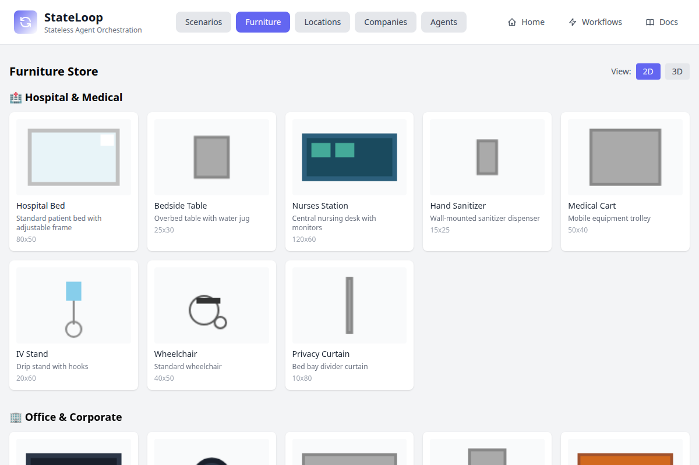
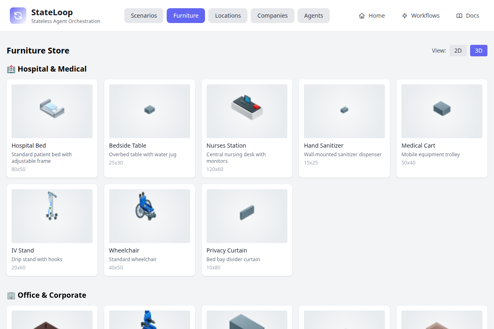
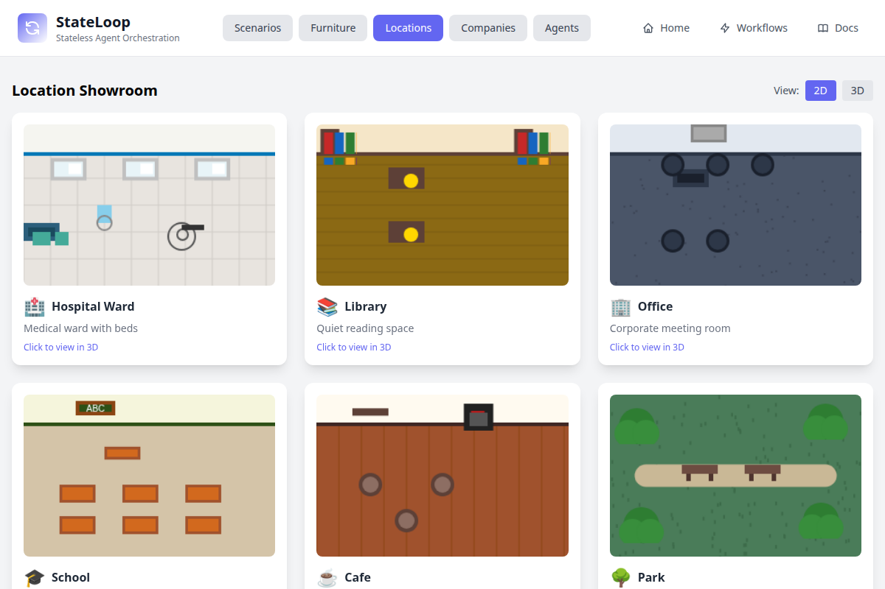
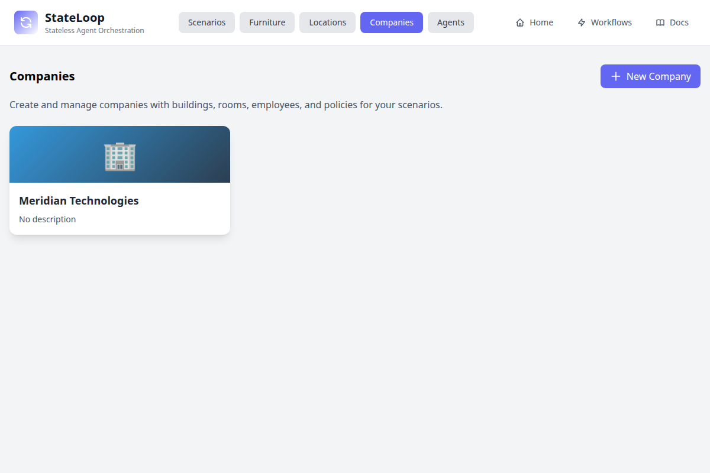
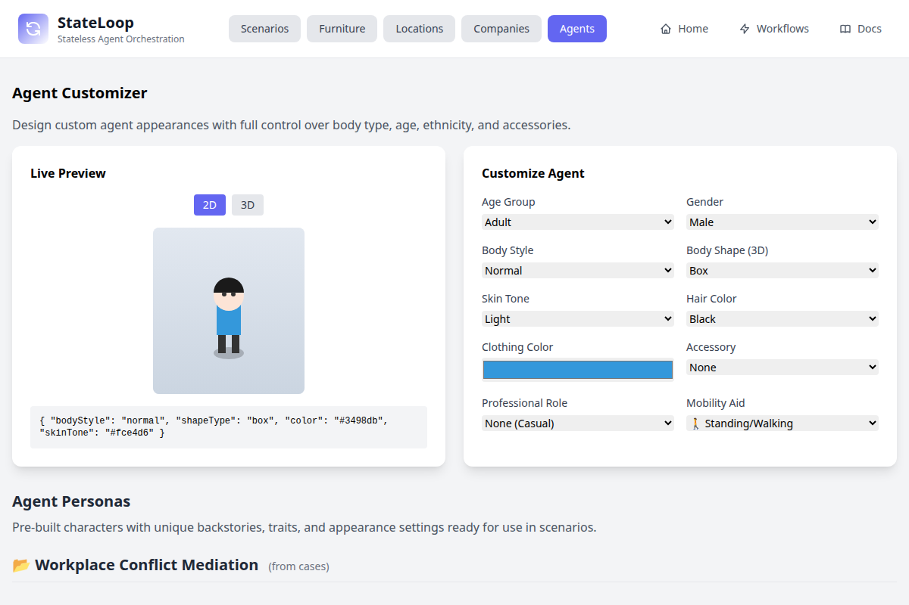
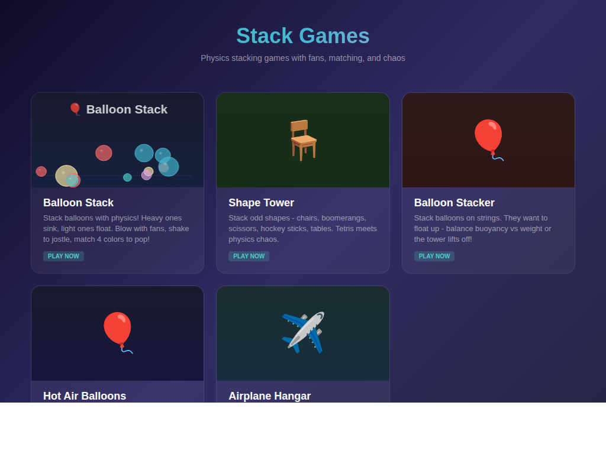

# Getting Started with StateLoop

So you want to watch AI agents argue with each other? You've come to the right place.

StateLoop is a system where AI agents negotiate, debate, and collaborate in real time. Each agent has secret goals, a personality, and a little pixelated character (called a **Thronglet**) that walks around, thinks, and speaks with speech bubbles. It's like watching a reality show — except the contestants are language models and the drama is about zoning permits.

---

## What Does It Actually Look Like?


Here's a workplace mediation in action. **Sarah** (the mediator, in red) is addressing both sides — you can see her speech bubble with the actual message and a thought bubble below showing her private reasoning (*"Good progress — they're both being constructive. I can see a compromise forming."*). **Alex** and **Jordan** stand nearby with their own hidden agendas. The right panel shows the five options on the table and the case status.

Every agent is blissfully unaware of what the others are secretly thinking. That's where it gets interesting.

---

## Getting It Running

```bash
git clone https://github.com/jonathanleahy/stateLoop.git
cd stateLoop
npm install
npm run dev
```

Open [http://localhost:3000](http://localhost:3000) and you're in.

| Where to go | What you'll find |
|------------|-----------------|
| `/` | The main Thronglet negotiation map |
| `/scenarios.html` | Browse scenarios, furniture, locations, companies, agents |
| `/workflows.html` | Chain scenarios into multi-stage pipelines |
| `/api-docs` | Interactive Swagger API docs (try everything from the browser) |
| `/stack-games.html` | Bonus: 5 physics games the agents built themselves |

---

## How It Works (The Short Version)

1. **Pick a scenario** — or write your own in plain text
2. **Agents get assigned** — each with a name, role, and secret agenda
3. **They take turns talking** — proposing options, countering, accepting, rejecting
4. **The system watches for resolution** — when enough agents agree, the case closes
5. **Or it times out** — because sometimes people just can't agree (relatable)

The clever bit: agents are **stateless**. Every turn, they receive the *entire* conversation history plus their private agenda. No memory tricks, no hidden state — just context in, response out. This makes everything reproducible and easy to debug.

---

## The Scenario Browser

Head to `/scenarios.html` — this is your launchpad.

### 35+ Ready-Made Scenarios


Each card shows what you're getting into: the title, location, how many agents are involved, and whether it's a negotiation or a collaborative writing task (marked "Collaborative"). Click any card to read the full scenario and launch it.

There's a *lot* of variety here:

| Vibe | What's in there |
|------|----------------|
| **Workplace** | Mediation sessions, feature planning, code reviews, union negotiations |
| **Creative** | Writing Fawlty Towers episodes, art commissions, podcast planning, game design pitches |
| **Civic** | City council zoning fights, climate debates, jury deliberations, school policy |
| **Personal** | Wedding planning chaos, flatmate interviews, family inheritance disputes, movie night arguments |
| **Healthcare** | Hospital hydration policy, AI ethics boards |
| **Community** | Dog park disputes, allotment committee emergencies, neighbourhood feuds |

### The Furniture Store

Every negotiation happens somewhere, and that somewhere needs furniture. The furniture store has seven categories of items that automatically populate your maps.

Here's the 2D view — clean and functional:



And here's the same items rendered in isometric 3D — hospital beds, wheelchairs, IV stands, all looking rather lovely:



Hospital scenarios get beds and privacy curtains. Offices get conference tables and whiteboards. Cafes get espresso machines and pastry displays. The system matches furniture to location automatically.

### The Location Showroom

Six built-in environments, each with its own colour palette, default furniture layout, and atmosphere:



**Hospital Ward** — beds, curtains, blue-white tones. **Library** — bookshelves, warm wood. **Office** — conference table, dark corporate. **School** — desks in rows, blackboard. **Cafe** — round tables, warm browns. **Park** — trees, benches, open green.

When a scenario says `LOCATION: Hospital`, the map knows what to do.

And in 3D:


Click any location to explore it in full 3D with camera controls.

### Companies

Companies add persistent organisational context. Create one with buildings, rooms, departments, employees, and HR policies — then reference it in scenarios for realistic workplace simulations.



This isn't just decoration. When a scenario references a company, agents can see the org chart, know who works where, and reference actual policies. It makes workplace negotiations feel grounded.

### Agent Customizer

Design your Thronglets down to the last detail. Body type, age group, skin tone, hair colour and style, clothing, accessories (glasses, hats, bowties, headphones), professional roles (nurse, doctor, police, business), and mobility aids.



The live preview updates instantly as you tweak settings. The JSON at the bottom can be copied straight into scenario files. Below the customizer, you'll see personas from your existing cases.

---

## Writing Your First Scenario

Scenarios are just text files. Here's the simplest negotiation you can write:

```
SCENARIO: Team Dinner Choice
LOCATION: Office

AGENT: Alice
AGENDA: You're paying, so budget matters. Prefer somewhere quiet.
AGREEABILITY: 60

AGENT: Bob
AGENDA: You love bold flavors. Won't go somewhere boring.
AGREEABILITY: 55

OPTIONS:
- Italian Place: Pasta, quiet atmosphere, $$
- Mexican Grill: Tacos, lively, $
- Sushi Bar: Fresh fish, trendy, $$$

RULES:
- Both must accept for resolution

MAX_ROUNDS: 10
```

Drop this in the `scenarios/` folder and it appears in the browser. That's it.

### The Tags That Matter

| Tag | What it does |
|-----|-------------|
| `SCENARIO:` | Names your negotiation |
| `LOCATION:` | Sets the map (office, hospital, cafe, park, school, library) |
| `AGENT:` | Creates a participant (need at least 2) |
| `AGENDA:` | Their secret goals — hidden from everyone else |
| `AGREEABILITY: 0-100` | How stubborn they are (25 = brick wall, 75 = pushover) |
| `APPEARANCE:` | Thronglet customization |
| `OPTIONS:` | What they're choosing between |
| `RULES:` | When the case resolves |
| `MAX_ROUNDS:` | Turn limit before timeout (default 20) |
| `PUBLIC INFO:` | Facts everyone knows |
| `ICON:` | Emoji for the scenario card |

### Making Scenarios That Actually Spark

The secret sauce is **tension**. Good scenarios have:

- **Conflicting but reasonable goals** — both sides should have a point
- **Hidden information** — Agent A knows something Agent B doesn't, and vice versa
- **Hard limits** — "I will absolutely not agree to relocation" creates real negotiation dynamics
- **Mixed personalities** — pair a 30 agreeability hardliner with a 70 agreeability diplomat
- **A moderator** — add an agent who uses `type "message" only` and has opening lines via `Say "..."`

Bad scenarios are ones where everyone wants the same thing. Boring. Give them reasons to disagree.

---

## Use Cases (What People Actually Do With This)

### HR Training & Conflict Resolution
Run workplace mediations where a neutral mediator facilitates between two employees. Test different approaches: does team restructuring work better than a communication protocol? What happens when one party has a hard limit the other doesn't know about?

### Creative Writing Rooms
Set `TASK_TYPE: document` and agents collaborate on scripts, proposals, or stories. Each brings a different creative vision. The Fawlty Towers scenario has five writers battling over whether an episode should be slapstick or dry wit — the resulting script is genuinely entertaining.

### Board Meeting Simulations
A CEO who wants to ship fast, an ethics officer worried about bias, a CTO with test data, and an HR director thinking about legal liability. Put them in a room and see what happens. Great for exploring how hidden information and different priorities shape group decisions.

### Civic & Policy Deliberation
City council zoning disputes, climate policy debates, school board decisions. Multiple stakeholders with different constituencies. Useful for understanding multi-party negotiations and exploring compromise strategies.

### Education & Training
Students can watch negotiations unfold, adjust agent personalities, and see how small changes (bump agreeability from 40 to 60) dramatically shift outcomes. It makes abstract concepts like "negotiation dynamics" visible and interactive.

### Multi-Stage Workflows
Chain scenarios together: brainstorm an idea, plan the implementation, build it. Each stage's output feeds into the next. This is how the stack games were made — AI agents went from "what if Tetris had chairs?" to a working game in three stages.

---

## The Workflow Designer

For anything more complex than a single negotiation, there's the workflow designer at `/workflows.html`.


Drag scenario nodes onto the canvas, connect them with edges, and run the whole pipeline. Output documents from one stage automatically feed into the next as context.

**Example: "Catchy Game Factory"**
1. **Find the Hook** — 3 agents brainstorm a game concept (using `idea-brainstorm` scenario)
2. **Plan MVP** — 4 agents scope the features and prioritize (using `feature-planning` scenario)
3. **Build It** — 3 agents write and code-review the implementation (using `js-implementation` scenario)

This workflow actually produced 5 playable games. The agents negotiated about what to build, planned the features, argued about code quality, and shipped it.

---

## The API

Every single feature is available via REST API. The interactive Swagger docs at `/api-docs` let you try everything from your browser.


### The Flow In Four Curls

```bash
# 1. Create a case from scenario text
curl -X POST http://localhost:3000/api/cases \
  -H "Content-Type: application/json" \
  -d '{"scenario": "SCENARIO: Dinner...", "participants": []}'

# 2. Get the setup prompt (feed this to your LLM)
curl http://localhost:3000/api/cases/{id}/auto-play

# 3. Submit setup + first message
curl -X POST http://localhost:3000/api/cases/{id}/setup \
  -H "Content-Type: application/json" \
  -d '{"setup": {...}, "firstAgent": {"name": "Alice", "message": "..."}}'

# 4. Or skip all that and auto-run with Claude:
curl -X POST http://localhost:3000/api/cases/{id}/run
```

### Key Endpoints

| Endpoint | What it does |
|----------|-------------|
| `POST /api/cases` | Start a new negotiation |
| `GET /api/cases/:id/auto-play` | Get the LLM prompt for whoever's turn it is |
| `POST /api/cases/:id/setup` | Submit the agent setup and opening message |
| `POST /api/cases/:id/submit` | Submit an agent's response |
| `POST /api/cases/:id/run` | Auto-run the whole thing with AI |
| `GET /api/scenarios` | List all scenarios |
| `POST /api/cases/:id/documents` | Create a shared document for collaborative tasks |
| `GET/POST /api/companies` | Manage companies |
| `GET /api/agents` | See all known agents |
| `GET /api/furniture` | Browse furniture categories |

Full reference: [SPECIFICATION.md](../SPECIFICATION.md)

---

## Bonus: The Games That Agents Built

The workflow system produced a suite of 5 physics-based stacking games, playable at `/stack-games.html`.



| Game | The Gist |
|------|----------|
| **Balloon Stack** | Weighted balloons, fans, a swaying pendulum, match 4 colours to pop |
| **Shape Tower** | Tetris, but with chairs, scissors, boomerangs, and hockey sticks |
| **Balloon Stacker** | Stack balloons by balancing buoyancy vs weight — tower flies away if you're careless |
| **Hot Air Balloons** | Land gently on platforms using heat and wind controls |
| **Airplane Hangar** | Pack different-sized planes into a hangar without clipping wings |

These exist because we pointed the workflow designer at a game creation pipeline and let the agents loose. They brainstormed concepts, argued about scope, wrote the code, reviewed each other's work, and shipped playable games. Not bad for a negotiation system.

---

## Where To Go Next

- **Just explore** — open `/scenarios.html`, pick something that sounds fun, hit "Use This"
- **Watch a negotiation** — the Thronglets will debate while you watch. Click "Replay" to see the messages with speech bubbles
- **Write your own** — create a `.txt` in `scenarios/`, follow the format above. The weirder the premise, the more entertaining the result
- **Go programmatic** — `/api-docs` has every endpoint. Create cases, submit responses, build integrations
- **Chain workflows** — `/workflows.html` for multi-stage pipelines
- **Deep dive** — [SCENARIO_FORMAT.md](../SCENARIO_FORMAT.md) has every tag, option, and trick available
- **Full spec** — [SPECIFICATION.md](../SPECIFICATION.md) for the complete architecture and API reference
